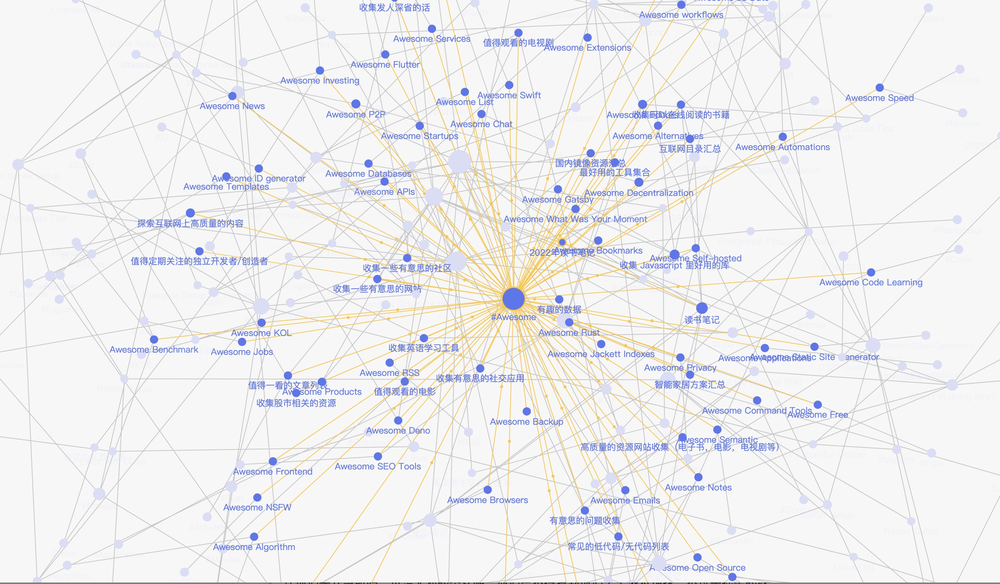

笔记很重要，一个好的笔记系统应该以一生的尺度去设计和维护，让我们自己受益一生。

所以：

1. 非运营商锁定很重要，离线很重要，我们不能指望一个公司，或者一个在线服务能服务好一个以一生为尺度的个人系统。
2. 笔记其实很简单，纯文本文件作为笔记完全够用，我们不需要任何运营商绑定的服务，重要的是笔记的内容，而不是形式。我们可以有很多辅助性的工具，但是最终的储存一定是一个简单易读的纯文本文件。进可攻，退可守！

<!-- more -->

所以我的[以一生为尺度设计的笔记系统](https://github.com/theowenyoung/wiki)就是一个纯文本的文件夹，里面保存了我所有能公开的笔记。至于公开笔记的原因，一方面，公开笔记能让我更有动力一直维护下去，另一方面，也许在某时可以给别人某种灵感，这会让我很满足。

近年来越来越多的人开始用[卢曼卡片盒笔记法](https://zhuanlan.zhihu.com/p/258561003)来记笔记，大多数人都是倾向于建立大量的笔记，然后再把这些笔记互相链接起来，以形成一个所谓的第二大脑。我的[笔记系统](https://wiki.owenyoung.com/)的也采用了这种形式。现在的链接情况大概是这个样子的：

大概快记了一年吧，笔记条目现在急剧增加，我发现多卡片式的笔记系统开始出现经典的“日记问题”，类似我们以前可能会写很多日记，但是随着时间的增长，这些日记其实已经变成了一个类似[Github 北极封存](https://archiveprogram.github.com/)的项目了。由于条目过多，所以很困难去再次检索，翻阅。

> 关于日记方面，现在其实有一个很好的记录形式，就是[子弹日记](https://bulletjournal.com/)
> ，清晰明了的格式，只记最重要的东西，以及索引日记。

笔记多了，即使有“第二大脑”的帮助下，你也会发现，很难通过卡片间找到灵感，因为卡片是在是太多了，仅仅通过卡片间互相链接的形式很容易忘记/错过某些过去的卡片。我目前的采用的办法是：归类，而且归的类越少越好。事实证明纯文本很强大，一个纯文本文件可以放进去超级多内容而大小并不会有多少
K。比如说，如果你在一个纯文本文件里面发送/放置你的原创推特，假设你平均每天发一条推特，假设你是活到 100 岁，其实这个推特的纯文本文件只有 36500
行，对于一个纯文本文件来说，这并不算太大。
我就用这个[纯文本文件](https://raw.githubusercontent.com/theowenyoung/wiki/main/thoughts.md)记录我的短想法。还有个很有名的[twtxt](https://github.com/buckket/twtxt)标准，就是用一个换行符作为分割的
txt 文件写推特。

以下是我目前整理出的大多数人可能会需要的几个纯文本文件笔记类型：

- quotes, 记录一些别人的话，[收集发人深省的话](/content/blog/quotes.md)
- thoughts, 记录一些自己的话,[短想法](content/blog//thoughts.md)
- journal, 日记，可按照不同年份保存，[2022 年的一些记录](/content/journal-2022.md)
- tools, 记录好用的工具，[最好用的工具集合](/content/tools.md)
- articles, 记录好文章, [收集值得阅读的文章](/content/articles.md)
- sources, 记录常用的内容源， [探索互联网上高质量的内容](/content/sources.md)
- answers，记录一些好的答案，[有意思的问题收集](/content/answers.md)
- inspires, 记录一些启发灵感的，有意思的东西, [收集一些给人灵感的东西](/content/inspires.md)
- tips，记录一些常用的技巧 [生活技巧](/content/tips/index.md)

以上这些就是我觉得大多数人都需要的一些公共类型的笔记，其他的类型就根据自己的类型来分类了。原则就是尽量少一点类型，这样更容易碰撞灵感和回顾，整理。
