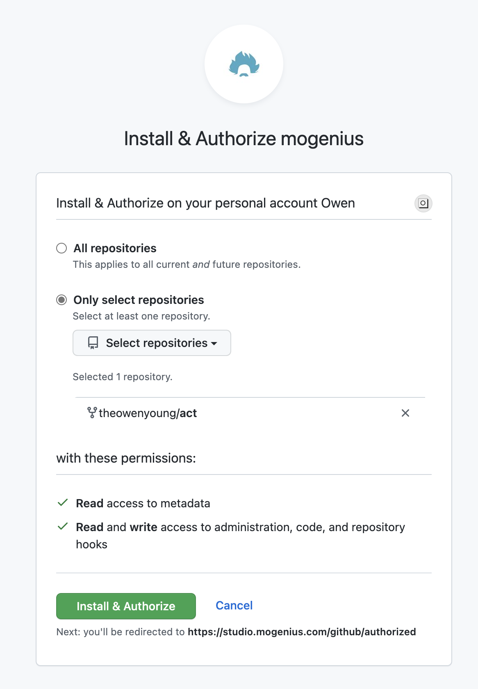
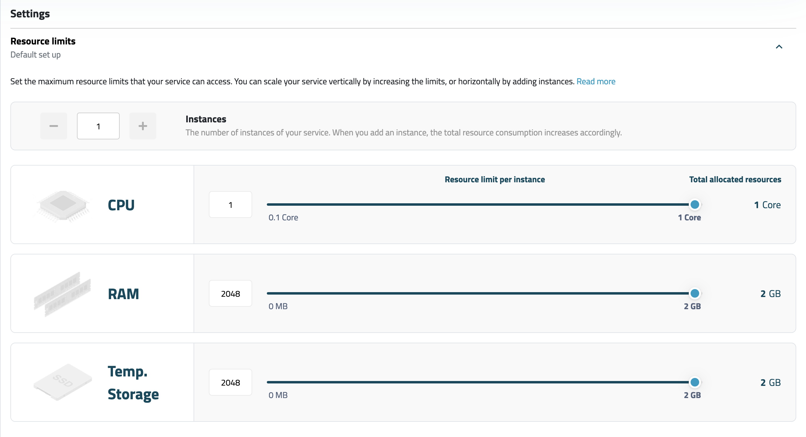
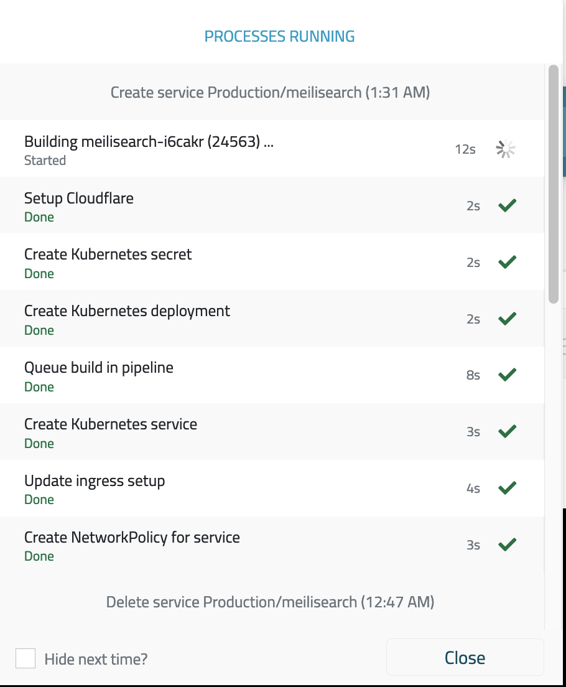

I deployed [Meilisearch](https://meilisearch.com/) on my VPS [a couple of days ago](/content/blog/add-search/index.md), but I'm panic, because I mess up my VPS a lot, and I rebuild my VPS a lot, so it's not a stable environment to deploy meilisearch. So I started to browse [free-for-dev](https://www.trackawesomelist.com/ripienaar/free-for-dev/), see if there are some good(and cheap) solutions for me. I saw this:

> [mogenius](https://mogenius.com/home) - A code-to-cloud platform to easily deploy any service, from static website to advanced microservice architectures. mogenius comes with fully managed hyper-scaling cloud resources, Kubernetes, CI/CD and security from Cloudflare. Free tier includes 1 CPU core, 2 GB RAM, 10 GB traffic, 4 GB SSD persistent storage.

**The main point:**

- Free tier includes 1 CPU core, 2 GB RAM, 10 GB traffic, 4 GB SSD persistent storage.
- from static website to advanced microservice architectures.

I think it's enough for my blog's search index.

<!-- more -->

[Mogenius](https://mogenius.com/home) said they "from static website to advanced microservice architectures", and they also have a decent plan for free tier. I decided to try it out. After completing the registration, it requires a mandatory mobile number verification. It's a bit annoying, but I'm glad to have a free tier, and it's a good way to avoid abuse. (There is a bug when you verify your mobile number, I'am using firefox, it seems the country code select can not show list correctly, so I just change a vpn to fix it. (maybe I should use chrome to test it, I almost give up because of this bug))

Let's see how to set it up:

## Step 1: Create cloudspace

Just click ADD button, and fill in the form.

## Step 2: Create a new servicee

Enter to the cloudspace, and click the add button to create a new service with `Use a template`, and search `meilisearch`

## Step 3: Configure the service

1. Fill the servicename, for me I just type `meilisearch`
2. Connect your github account(you can give it only selected repo permissions, you must selected at least one repo, it can be any public repo)

   Screenshot:
   

3. Click `Add repository`, input the repo name, I input it as `meili`, and with `public` permission.

   Screenshot:

   

4. set resources limit (if needed, the default value is a recomendation from Mogenius).

5. set environment variables:

   1. add `MEILI_MASTER_KEY` as key vault to protect your master key. (Click `create new secret` to fill the secret)
   2. the following environment variables can be plain text type.

      ```bash
      MEILI_NO_ANALYTICS=true
      MEILI_ENV=production
      ```

      All environment options are [here](https://docs.meilisearch.com/learn/configuration/instance_options.html#environment)

   Screenshot:

   

6. optional, set custom domain. I set it to `meili.owenyoung.com`, I set a CNAME record `meili.owenyoung.com` to `meilisearch-prod-meilisearch-r4efxz.mo2.mogenius.io`, you will get the endpoint after the service created.

   Screenshot:

   

7. Then, click the `Create Service` button. It may take 1 minute to build and deploy the service.

## Step 5: Get your meilisearch admin key, and user key

After the service is created, the meilisearch is ready to use, you can visit <https://meili.owenyoung.com/> to test if everything is worked fine. At this moment, the default meilisearch template version is [`v0.27.0rc1`](https://docs.mogenius.com/services/various/meilisearch), the following is the success output:

```json
{ "status": "Meilisearch is running" }
```

You need to run the bash script to get the admin key and user key:

```bash
curl \
  -X GET 'https://meili.owenyoung.com/keys' \
  -H "Authorization: Bearer you-master-key" \
  | json_pp
```

We'll use them in the next step.

## Step 6: Setup doc-scraper

We need to build search index after every updates of our blogs, I use Github Actions to build my blog, so I just add a job after the site is deployed. We'll use [docs-scraper](https://github.com/meilisearch/docs-scraper) to scrape our whole site with `sitemap.xml` file. [docs-scraper](https://github.com/meilisearch/docs-scraper) will help us to build heading and content level search index, it'll bring the best search experience for our readers.

> The current [docs-scrape is only adapted with `0.27.x`](https://github.com/meilisearch/docs-scraper#-compatibility-with-meilisearch), at this moment, the latest meilisearch version 0.28 is not supported, I have submitted [an issue](https://github.com/meilisearch/docs-scraper/issues/231), so the default Mogenius meilisearch template version `0.27.0rc1` is fine, we can also upgrade it to `v0.27.2`.(I have done this by change the [Dockerfile](https://github.com/theowenyoung/meili/blob/main/Dockerfile), Mongenius will monitor the updates, and automatically deploy the updates)

See the [`.github/workflows/build.yml`](https://github.com/theowenyoung/blog/blob/main/.github/workflows/build.yml)

```yaml
name: Deploy Site
on:
  workflow_dispatch:
  push:
    branches:
      - main
jobs:
  build-deploy:
    runs-on: ubuntu-latest
    steps:
      - uses: actions/checkout@v3
      - run: make install
      - name: Build Site
        run: make build
      - name: Deploy
        uses: peaceiris/actions-gh-pages@v3
        with:
          publish_dir: ./public
          github_token: ${{ secrets.GITHUB_TOKEN }}
  scrape-and-build-search-index:
    needs: build-deploy
    runs-on: ubuntu-latest
    steps:
      # wait github pages publish
      - run: sleep 1m
      - uses: actions/checkout@v3
      - name: Run docs-scraper
        env:
          HOST_URL: "https://meili.owenyoung.com"
          API_KEY: ${{ secrets.MEILISEARCH_API_KEY }}
          CONFIG_FILE_PATH: ${{ github.workspace }}/meilisearch-docs-scraper-config.json
        run: |
          docker run -t --rm \
            -e MEILISEARCH_HOST_URL=$HOST_URL \
            -e MEILISEARCH_API_KEY=$API_KEY \
            -v $CONFIG_FILE_PATH:/docs-scraper/config.json \
            getmeili/docs-scraper:v0.12.2 pipenv run ./docs_scraper config.json
```

`MEILISEARCH_API_KEY` will be the admin key from the previous step.

[`meilisearch-docs-scraper-config.json`](https://github.com/theowenyoung/blog/blob/main/meilisearch-docs-scraper-config.json) will be placed in the root of the repository, and it will be used by `docs-scraper` to scrape the site. Here is my config file:

```json
{
  "index_uid": "owen-blog",
  "sitemap_urls": ["https://www.owenyoung.com/sitemap.xml"],
  "start_urls": [""],
  "scrap_start_urls": false,
  "stop_urls": [
    "https://www.owenyoung.com/categories/",
    "https://www.owenyoung.com/tags/",
    "https://www.owenyoung.com/en/tags/",
    "https://www.owenyoung.com/en/categories/",
    "https://www.owenyoung.com/pages/",
    "https://www.owenyoung.com/en/pages/"
  ],
  "selectors": {
    "lvl0": {
      "selector": ".detail-page .p-category",
      "default_value": "Random"
    },
    "lvl1": {
      "selector": ".detail-page .p-tags",
      "default_value": "Notes"
    },
    "lvl2": ".detail-page .entry-title",
    "lvl3": ".e-content h2",
    "lvl4": ".e-content h3",
    "text": ".e-content p, .e-content li"
  },
  "strip_chars": " .,;:#",
  "min_indexed_level": 2,
  "custom_settings": {
    "synonyms": {
      "js": ["javascript", "nodejs"]
    },
    "stopWords": ["一", "的", "是"]
  }
}
```

> Cause I'm using Chinese and English, so I added [a lot of stop words of Chinese.](https://github.com/theowenyoung/blog/blob/main/meilisearch-docs-scraper-config.json)

Then the Github Actions workflow will run `docs-scraper` to scrape the site after the site is deployed.

## Step 7: Setup the frontend

See my [search template](https://github.com/theowenyoung/blog/blob/main/templates/search.html), basically, you need to include the [docs-searchbar](https://github.com/meilisearch/docs-searchbar.js) css and js, and add an `<input type="search" id="search-bar-input" placeholder="Search" />` to whereever you want to include the search bar. And add the following script to init:

```js
docsSearchBar({
  hostUrl: "https://meili.owenyoung.com",
  apiKey: "your-user-api-key",
  indexUid: "owen-blog",
  inputSelector: "#search-bar-input",
});
```

## Conclusion

You can see the all source code on [my blog source code](https://github.com/theowenyoung/blog).

As a programmer, it's not a big deal to setup those things with [mogenius](https://mogenius.com/home), sometimes their UI prompts are not very friendly, for example:

1. Firstly, I tried to create meilisearch without the template, the git address I entered at the beginning was `https://github.com/meilisearch/meilisearch`, then I can't create the service, the error message is: `This field is required.`, finally I tried another git url with suffix `.git`, then the form is valid, and I can choose the git branch. I don't know why they don't allow me to choose a tag branch, only the normal branches are allowed, luckily, Meilisearch has [one normal release branch](https://github.com/meilisearch/meilisearch/tree/release-v0.27.2), so I can choose it.
2. Their log UI is broken on Firefox browser, the edge browser is okay.
3. Even in Edge browser, the CI/CD monitor UI is broken, with an always refreshed page.

I don't know if they will offer a config file to setup those form, like `vercel.json` or `netlify.toml`, if so, it'll be easy for other non-programmers to setup those things.

Finally, I'm appreciate that they can offer a so decent free plan, I hope I don't need to migrate it to another service. Let's see.
