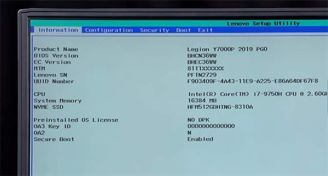
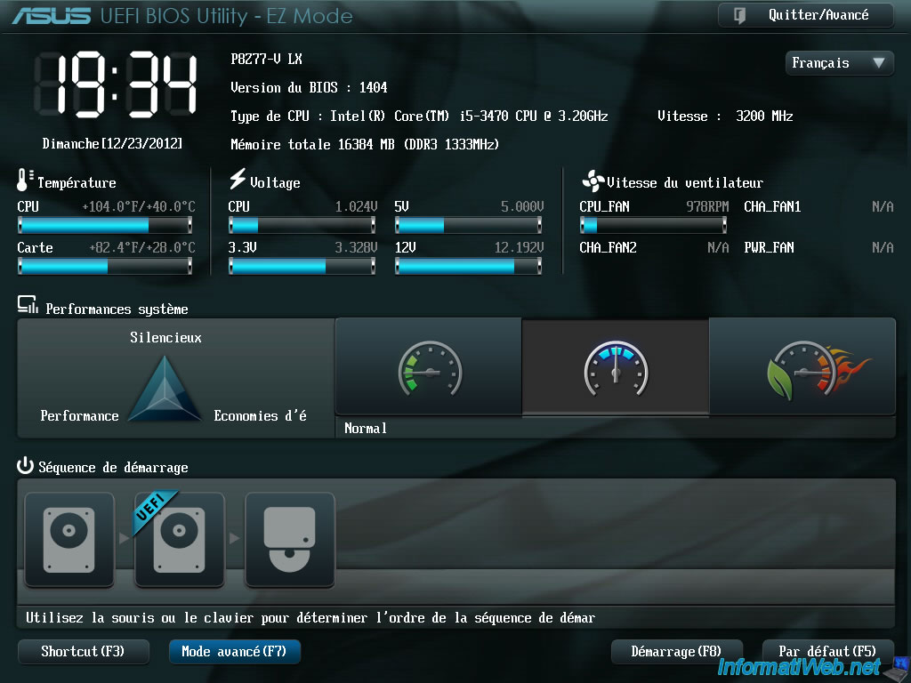
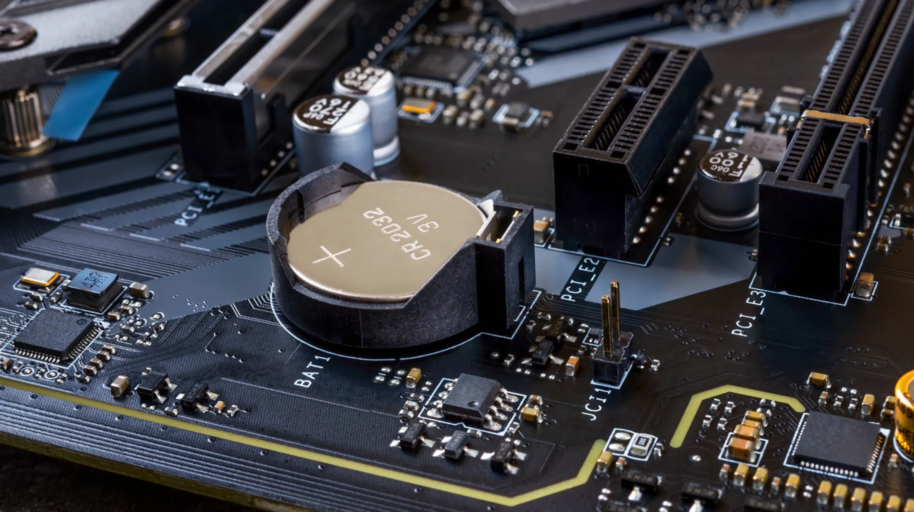
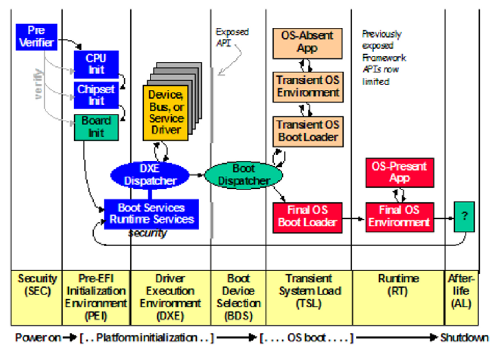

以前看过一个面试题，当你从浏览器地址栏输入 url 后，按下回车，具体会发生什么，这对这道题还挺有信心的，但是你要我说按下电脑开机键会发生什么，我是真的不知道。通过这次学习终于知道了一些：）

> 但是我绝对不是专家，只是一个刚接触这一块的新手，这篇文章里的所有东西都是根据[很多文章和论文](#References)，以及我自己的实践得来的，所以里面的信息如果有错误，请帮助我更正它！

<!-- more -->

## 流程

### 1. CPU 执行 Firmware setup 程序

当用户按下开机键，电脑就通电了，这个时候 CPU 先启动，它的工作就是不断的执行给他的指令，而初始指令就是主板写在硬件里的 Firmware setup 程序, 现代电脑的 Firmware setup 程序（2014 年后生产的电脑）基本上使用的都是 [Unified Extensible Firmware Interface](https://uefi.org/) (UEFI)标准。

> UEFI 是一种“固件程序”，固化在一个焊接或插在主板上 EEPROM (electrically erasable programmable read-only memory) 芯片上，并且暴露一些接口以和软件进行交互。
>
> EEPROM 是带电可擦可编程只读存储器。 是一种掉电后数据不丢失的存储芯片，所以很适合存放这种固件程序，轻易不咋变动，但要变动的时候，也能比较容易的变动。

UEFI 是 [Basic Input/Output System (BIOS) ](https://en.wikipedia.org/wiki/BIOS) 的现代版本,基本上 2014 年之后的机器附带的主板用的都是 UEFI 程序了。

当你看到以下这个菜单图片：

这并不是代表你的电脑用的是传统的 BIOS，虽然这个界面看起来很原始，但是其实这也是 UEFI 程序的，只是他的界面和 BIOS 一样是文本用户界面 (TUI)，更现代的 UEFI 可能会带有酷酷的图形化 (GUI) 操作界面，像这样的：

我们可以通过在电脑开机的时候，连续按 F1 键（或者别的什么键）进入 UEFI 的设置 菜单。

> 很多人会混用 UEFI,BIOS 这些名词，我觉得这个[回答](https://superuser.com/a/1722488)解释的特别好。
>
> PS. 我觉得现在应该弃用 BIOS 这个名字，用 Firmware setup 程序来代替它。

### 2. Firmware setup 程序开始运行，并从 CMOS 里面读取当前系统时间

CMOS 是位于主板上的一个简单的存储装置，现在的实际使用中，只被用于记录时钟 RTC 信息，所以这个东西需要一直有电才能保持系统时间的正确性，所以 CMOS 被设计为：开机的时候用电源供电，关机的时候就用纽扣电池供电。如图：

但其实操作系统在有网的时候，一般也用不到 CMOS 里的时钟信息，因为它都是访问网络上的时间去校准时间的，除非没有网络才会用这个值。

> 网络上很多文章说 Firmware setup 程序会把用户的配置信息（比如启动项配置等）存放到 CMOS 里面，其实现代的电脑都不会这样做了，因为只有时钟信息需要持续的电源来运行，别的东西都可以存在文件系统里，UEFI 的配置信息都是存放在文件系统里的。

### 3. Firmware setup 程序开始执行电脑安全自检

这个阶段被称为：SEC，security 阶段，做一些硬件方面的安全检查，看下各种东西都 ok 不 ok，之后的整个流程大概是这样：

### 4. 初始化 EFI 的执行环境， 比如 cpu ，各种功能芯片等

这个阶段被称为 PEI，Pre Extensible Firmware Interface，Pre-EFI，EFI 是 UEFI 给系统引导程序（Boot Loader）准备的运行环境，就像 Bash 脚本环境一样，这个环境可以执行`.efi`文件。`.eft`文件就是系统引导程序的入口文件。在这个阶段会把 CPU，主内存，其他专用功能芯片组（比如音频芯片）啥的都准备好。

### 5. DXE 阶段

Drive Execution Environment, 在这个阶段，DXE 调度程序将发现并执行相关固件卷中可用的 DXE 驱动程序，这些驱动程序负责更高级别的平台初始化和服务，比如系统管理模式（SMM）的设置，更高级别的固件驱动程序，如网络，启动盘，热量管理等，并且为后面的阶段提供运行时的服务接口。

### 6. BDS 阶段

Boot Device Selection 阶段，这个阶段，UEFI 会加载各种设备的驱动程序，比如硬盘，U 盘的驱动，并运行 Boot Loader 引导程序：

1. 初始化控制台 console 设备，看看系统有多少可以启动的设备
2. 加载必要的设备驱动比如硬盘，u 盘等
3. 加载输入输出设备驱动，比如键盘，鼠标等
4. 搜索可用的启动设备（其实就是搜索具有 FAT32 分区格式的设备，FAT32 分区是微软设计的格式，单文件最大 4G，格式化 U 盘的时候可以看到这种格式选项）

我们一般会在硬盘里分出一个专门的 EFI 分区用来存放引导程序：

这个磁盘分区里的文件结构大概如下：

如果你有多个引导程序的话，你可以在 UEFI 提供的 boot 菜单里选择使用哪一个（按 F12 可以进入 boot 引导程序菜单），默认的话就是进入排名第一的那个。UEFI 提供的引导菜单其实是一级引导，然后进入二级引导程序：

> 二级引导程序有 Grub2, Windows boot manager 等, 如果你电脑预装的是 Windows 系统的话，那就只有 Windows Boot mananer ，如果你装了双系统，比如 Ubuntu 等 Linux 系统的话，Linux 系统会使用 Grub2 作为二级引导系统， Grub2 支持 windows，linux，macos 等系统的引导。

到了这里，二级引导程序就会根据用户的配置，把 CPU 的控制权交给真正的操作系统了，至此，电脑才算开始启动 OS 了。

## 总结

这篇文章有太多名词了，如果没有装过几次操作系统的，可能听的云里雾里的，所以如果你感到云里雾里的也没必要深究，等你装过几次系统，遇到一些错误，然后在解决的过程中，你就慢慢理解这些东西了。

## References

- [实体机安装双系统多系统教程 及引导修复指南](https://neucrack.com/p/330)
- [如何在 Windows10 下安装 ubuntu 双系统(无 U 盘)](https://www.cnblogs.com/yuxiayizhengwan/p/15132486.html)
- [浅谈操作系统-启动过程](https://zhuanlan.zhihu.com/p/32280478)
- [浅谈 UEFI 启动](https://blog.shenzeyu.cn/2015/12/06/%E6%B5%85%E8%B0%88UEFI%E5%90%AF%E5%8A%A8/)
- [阮一峰: 计算机是如何启动的？](https://www.ruanyifeng.com/blog/2013/02/booting.html)
- [BIOS 与 UEFI 引导流程](https://www.cnblogs.com/pipci/p/13280030.html)
- [What is the terminologically correct way to call the setup screen before boot?](https://superuser.com/questions/1722483/what-is-the-terminologically-correct-way-to-call-the-setup-screen-before-boot)
- [Boot Sequence](https://edk2-docs.gitbook.io/edk-ii-build-specification/2_design_discussion/23_boot_sequence)
- [CMOS](https://wiki.osdev.org/CMOS)
- [了解基于 UEFI 的现代平台启动](https://depletionmode.com/uefi-boot.html)
- [BIOS 追 Code 之 BDS phase -＞ TSL-＞ RT-＞ AL](https://blog.csdn.net/weixin_45279063/article/details/115508961)
