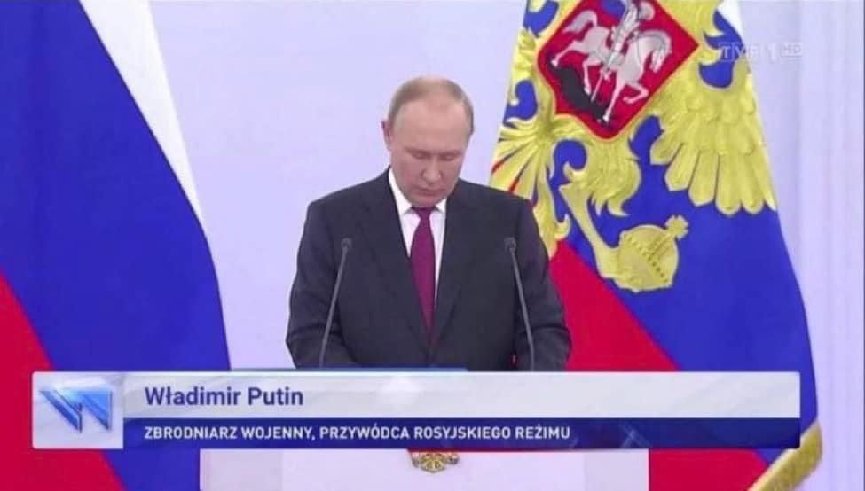

刷推看到一篇报道
[馬英九提2個呼籲 盼蔡總統國慶說明兩岸非兩國](https://www.cna.com.tw/news/aipl/202210060129.aspx)，里面提到马英九说：

> 在大陸1982年的憲法前言中，也把台灣列為「大陸不可分割的神聖領土」。在這種情況下，高喊台陸雙方互不隸屬，不但不現實，而且是違反現實的。這反而引起海內外有識之士擔憂，認為是「新兩國論」的挑釁。

我想提醒马英九先生的是，[大陆宪法](http://www.gov.cn/gongbao/content/2004/content_62714.htm)还说了：

> 第三十四条　中华人民共和国年满十八周岁的公民，不分民族、种族、性别、职业、家庭出身、宗教信仰、教育程度、财产状况、居住期限，都有选举权和被选举权；但是依照法律被剥夺政治权利的人除外。
>
> 第三十五条　中华人民共和国公民有言论、出版、集会、结社、游行、示威的自由。
>
> 第三十六条　中华人民共和国公民有宗教信仰自由。

<!-- more -->

我想知道马英九先生在夜深人静的时候，想到自己自欺欺人的样子会不会觉得好笑？

我一直都觉得自由媒体对独裁者的话给的版面太大了，我不明白他们的话有任何值得让人知道的必要？

普京在入侵乌克兰之前也曾多次保证要保障乌克兰的安全。

独裁者的特征就是国王即法律，他自己拥有最高解释权，问问香港人中英联合声明是不是废纸就知道了。

通过技术来解释条纹是普通法国家的特权，想在专制国家里寻找技术型漏洞就像白痴一样。

我喜欢这家波兰电视台给普京的title：

战犯普京。
