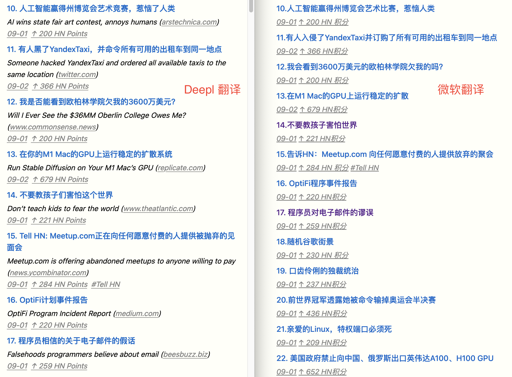
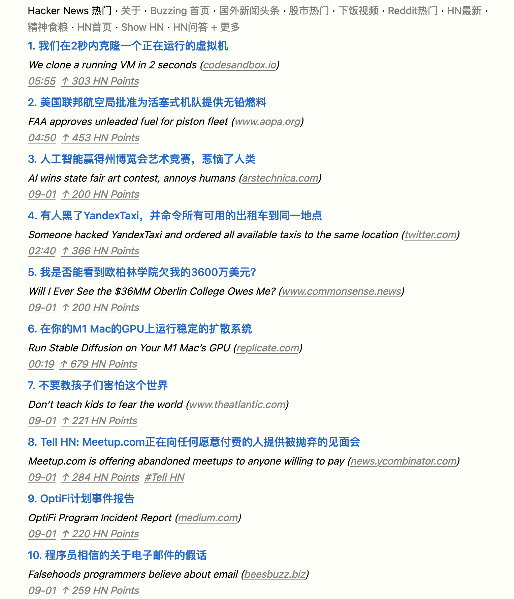
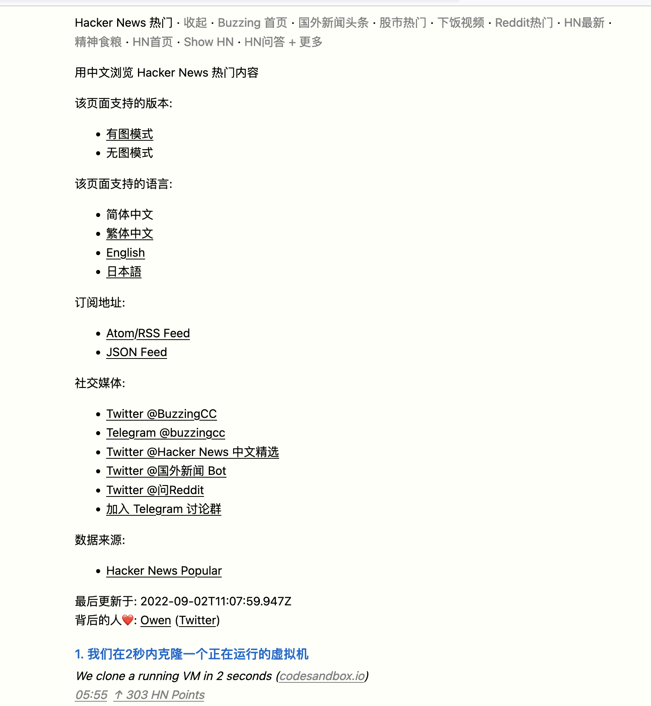
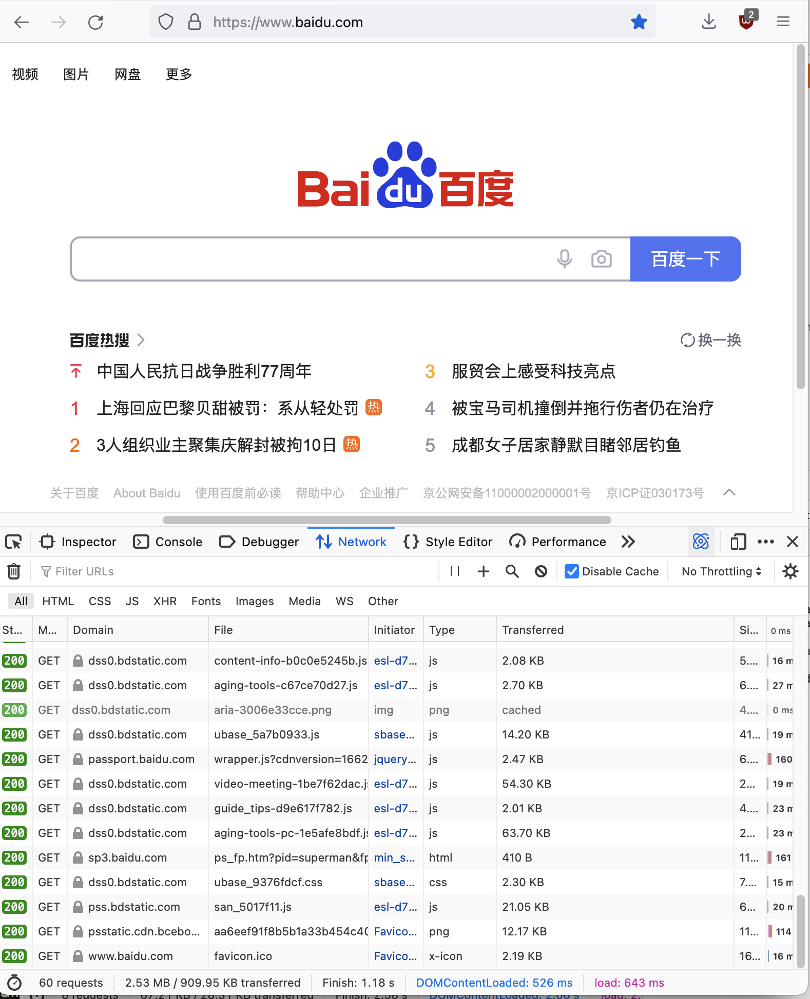

在最近两周里，我用 [Deno](https://deno.land/) 重写了[Buzzing](https://www.buzzing.cc)，这是一个把英文世界热门的讨论，尤其是用户产生的内容，比如 [reddit](https://www.reddit.com) ，[推特](https://twitter.com/)，以及我最喜欢的 [hackernews](https://news.ycombinator.com/) ，把这些优质内容标题翻译成中文，然后根据不同的主题汇总到不同的子网站。我将在本文分享 Buzzing 的一些技术细节和制作历程。

<!-- more -->

描述完之后，怎么感觉那么像一个标准的垃圾站啊，内容搬运农场！

但没办法，我对这样的“垃圾站“有真实的需求，我好奇世界上那些奇怪的人，固执的人，以及有趣的人在做什么，在读什么，在思考什么问题，但很难在中文世界中找到这样的家园。而在英文世界中，不仅有许多专业的新闻/杂志网站，比如：

- [New Yorker](https://www.newyorker.com/)
- [The Atlantic](https://www.theatlantic.com/)
- [Axios](https://www.axios.com/) - 简明扼要的新闻，有重点的新闻，几句话新闻的精髓
- [赫芬顿邮报](https://www.huffpost.com/)
- [Politico](https://www.politico.com/) - 政治评论和报道
- [卫报](https://www.theguardian.com/)
- [每日电讯报](https://www.telegraph.co.uk/) - 英国
- [The Rest of World](https://restofworld.org/) - 科技报道
- [还有更多请参见我的笔记](/content/sources.md)

还有很多网址聚合类的网站，比如 [Hacker News](https://news.ycombinator.com), [Lobster](https://lobste.rs/), [Reddit](https://www.reddit.com)


这些网址聚合类网站的内容由用户提交（大多数是链接），然后其他用户投票，最终决定哪些内容会被展示在首页，为不同兴趣的人提供了一个绝佳的互联网冲浪入口，所以 Reddit 的 slogan 就是："The Front Page of the Internet" , (刚去查证了一下，发现 Reddit 已经改了自己的 Slogan，[旧的 reddit](https://old.reddit.com/)的标题依然是这个，[新的](https://www.reddit.com/)已经变成了："Dive into anything")

鉴于目前中文网络环境的言论管控，自我审查等，我觉得我的生活已经离不开这些英文信息网站了。但是由于语言墙，快速浏览大量的非母语信息，并找出自己真正感兴趣的内容对我来说真的很难。所以我非常感谢现代翻译技术的发展，尤其是[deepl](https://www.deepl.com/translator)的翻译质量。在此之前，各种翻译工具对技术文章的翻译经常令人啼笑皆非，比如各种 stackoverflow 垃圾站，我在测试各种工具之后，发现 deepl 的翻译的确是最好的（虽然对于小部分技术名词，也有一些问题）。可以看下[hn 站点下](https://hn.buzzing.cc/) Deepl 和微软的翻译对比效果：



所以基于以上的需求，我在 2020 年末制作了 Buzzing 的第一个版本，大概长这样：


各个主题的子网站长这样：


推出了一年，我觉得自己应该是 Buzzing 里最重度的用户吧，以至于我自己最常逛的主题`hn.buzzing.cc`的内容根本不够我看，所以我甚至专门为自己写了`Feed for Owen`:


这个网站抓取 Hacker News 上 Points 大于 1 的提交，基本上就是 HN 上所有的提交了，同时过滤掉最低质量的提交。但由于可以用中文快速浏览标题，所以这样的信息量对我来说就是小菜一碟。

我在使用这个专门为我自己写的网站半年之后得出的结论就是，光看热门的 HN 提交，真的会让你错过超多有意思的人，有意思的事。这其中大多数都不会进入到 Hacker News 首页。

再来看看我最终的成果，也就是[New Buzzing](https://www.buzzing.cc)：

默认版：


Lite 版：



每个主题都有一个 lite 的版本，无图，可以无干扰的快速浏览大量信息。同时每个站点都提供了 [JSON Feed](https://hn.buzzing.cc/feed.json) 和 [Atom Feed](https://hn.buzzing.cc/feed.xml)，方便使用 RSS 阅读器订阅。站点像之前一样，同时支持 4 种语言，中文简体，中文繁体，英文，日文，并且每条内容均会显示原文，方便对比参照。同时新增了 4 个子网站，[纽约客](https://newyorker.buzzing.cc), [Lobste](https://lobste.buzzing.cc), [下饭视频](https://videos.buzzing.cc/)，[Linux](https://linux.buzzing.cc/)以及我最爱的[HN 最新](https://hnnew.buzzing.cc/)



可以说这个版本的 Buzzing 完全是受 Hacker News 社区影响的产物，纯静态 HTML，无 JS，无额外的 CSS 文件， 总共只有 100 多行 CSS 样式，内嵌在 HTML 页面里面，所以如果你访问<https://hn.buzzing.cc/lite/>的话，你只会加载一个 HTML 页面，没有多余的请求（icon 是浏览器为了渲染 favicon 请求的）：


30KB 的页面里其实包含了多达 200 条的内容。而于此同时，当我打开百度的首页（一个我们用来测网络是否正常的网站，页面看起来如此简洁！）：



你会发现他加载了多达 60 个请求，数据量多达 2.53M。吓人。

接下来分享一些 New Buzzing 的技术细节：）

## 技术细节

之前的 Buzzing 部署在 Github Pages 里，New Buzzing 迁移到了 Cloudflare 的 [Pages 服务](https://pages.cloudflare.com/)：


（其实为啥要搞 New Buzzing，就是因为 Github 的客服说我的 Buzzing 占的空间太大了，其中最大的一个站点占用了 60 多 G！因为之前设计的不合理，太依赖静态网站，每个 Tag，每月的 Archive 页面，甚至每个文章的详情页面都生成了 HTML，一开始还好，后来整个网站就变得越来越大，由于网站太大，用 force push 到 Github 很容易失败，所以只能正常 push，导致 repo 越积越大，直到 Github 都受不了了联系我。。而我对维护工作也变得越来越害怕）

所以新版的 Buzzing，痛定思痛，决定网页全面精简化，那就是每个子网站只有 1 个页面! `index.html`(有点吹牛，但是核心就是只有 1 个页面)，以下：

```bash
.
├── 404.html
├── _redirects
├── en
│   ├── feed.json
│   ├── feed.xml
│   ├── index.html
│   └── lite
│       ├── feed.json
│       ├── feed.xml
│       └── index.html
├── favicon.ico
├── feed.json
├── feed.xml
├── icon.png
├── index.html
├── ja
│   ├── feed.json
│   ├── feed.xml
│   ├── index.html
│   └── lite
│       ├── feed.json
│       ├── feed.xml
│       └── index.html
├── lite
│   ├── feed.json
│   ├── feed.xml
│   └── index.html
├── robots.txt
└── zh-Hant
    ├── feed.json
    ├── feed.xml
    ├── index.html
    └── lite
        ├── feed.json
        ├── feed.xml
        └── index.html
```

这样 Build 速度都不到 1s，目前 20 多个站点的 build 时间 30s 以内搞定（用 Deno），同时用一个动态站点`i.buzzing.cc` 来提供不常被访问的 Tag [页面](https://i.buzzing.cc/hn/tags/show-hn/)，Archive [页面](https://i.buzzing.cc/hn/issues/2022/31/), 以及[详情页面](https://i.buzzing.cc/hn/posts/2022/32/en_hn_2022_08_11__32426777/)，这些页面都属于低频访问，如果每次都生成静态页面的话，会用掉大量的时间。

同时，新增了[www.buzzing.cc](https://www.buzzing.cc/)作为所有子站点的聚合页面，在每次子站点生成之后生成。

具体的生成过程如下，以 HN 站点为例：

```bash
cache
├── 1-raw
│   └── 2022
│       └── 09
│           └── 03
│               └── hn
│                   ├── en_hn_2022_09_03_21_13_18_954_44__32700019.json
│                   └── en_hn_2022_09_03_21_13_18_954_45__32700066.json
├── 2-formated
│   └── 2022
│       └── 09
│           └── 03
│               └── hn
│                   ├── en_hn_2022_09_03__32696241.json
│                   └── en_hn_2022_09_03__32700066.json
└── 3-translated
    └── 2022
        └── 09
            └── 03
                └── hn
                    ├── en_hn_2022_09_03__32696241.json
                    └── en_hn_2022_09_03__32700066.json
current
└── items
    └── hn
        └── items.json
archive
└── hn
    ├── archive
    │   └── 2022
    │       └── 35
    │           └── items.json
    ├── issues
    │   └── 2022
    │       └── 32
    │           └── items.json
    └── tags
        └── show-hn
            └── items.json
```

`1-raw` 用来存放从`Hacker News`或其他站点抓取的原始数据

使用以下 adapter，把原始数据格式化到`2-formated`目录下:

```bash
adapters
├── devto.ts
├── googlenews.ts
├── hn.ts
├── hn_test.ts
├── lobste.ts
├── lobste_test.ts
├── mod.ts
├── newyorker.ts
├── ph.ts
├── reddit.ts
├── rss.ts
├── source.ts
├── twitter.ts
└── twitter_test.ts
```

格式化后的数据长这样：

```json
{
  "id": "en_hn_2022_09_02__32677727",
  "url": "https://www.commonsense.news/p/will-i-ever-see-the-36-million-oberlin",
  "date_published": "2022-09-02T01:35:39.646Z",
  "date_modified": "2022-09-02T01:35:39.646Z",
  "_original_published": "2022-09-01T15:25:05.000Z",
  "_original_language": "en",
  "_translations": {
    "en": {
      "title": "Will I Ever See the $36MM Oberlin College Owes Me?"
    }
  },
  "authors": [
    {
      "name": "fortran77",
      "url": "https://news.ycombinator.com/user?id=fortran77"
    }
  ],
  "_score": 200,
  "_num_comments": 194,
  "external_url": "https://news.ycombinator.com/item?id=32677727",
  "image": "https://substackcdn.com/image/fetch/w_1200,h_600,c_limit,f_jpg,q_auto:good,fl_progressive:steep/https%3A%2F%2Fbucketeer-e05bbc84-baa3-437e-9518-adb32be77984.s3.amazonaws.com%2Fpublic%2Fimages%2Feb00ec25-b252-44f2-a06a-87cea18ea630_1440x1440.jpeg"
}
```

我让它的格式尽量和[jsonfeed](https://www.jsonfeed.org/)保持一致，同时扩展少量的自有属性。格式化后，会删除`1-raw`的原始文件。

全部格式化完成之后，进入翻译环节，翻译程序只需要读取标准的 formated 文件，然后把`_translations`下的字段翻译成多个 target 语言，翻译后文件存放在`3-translated`下，变成如下模样：

```json
{
  "id": "en_reddit_2022_09_02__r--Bogleheads--comments--x3bi2g--what_to_invest_in_mega_backdoor",
  "url": "https://www.reddit.com/r/Bogleheads/comments/x3bi2g/what_to_invest_in_mega_backdoor/",
  "date_published": "2022-09-02T01:35:40.828Z",
  "date_modified": "2022-09-02T01:35:40.828Z",
  "_original_published": "2022-09-01T16:07:45.000Z",
  "_original_language": "en",
  "_translations": {
    "en": {
      "title": "What to invest in mega backdoor"
    },
    "zh-Hans": {
      "title": "投资于巨型后门的内容"
    },
    "zh-Hant": {
      "title": "投資於巨型後門的內容"
    },
    "ja": {
      "title": "メガ・バックドアに何を投資するか"
    }
  },
  "_links": [],
  "tags": ["Bogleheads"],
  "authors": [
    {
      "name": "oswestrywalesmate",
      "url": "https://old.reddit.com/user/oswestrywalesmate"
    }
  ],
  "_score": 3,
  "_num_comments": 6,
  "external_url": "https://old.reddit.com/r/Bogleheads/comments/x3bi2g/what_to_invest_in_mega_backdoor/"
}
```

接下来进入存档环节，存档程序读取`3-translated`下的文件，根据文件的内容，把 items 分别存放到：`current`和`archive`目录下，同时删除`3-translated`下的文件：

比如`current/hn/items.json`下的文件，大概结构是这样：

```json
{
  "items": {
    "en_hn_2022_09_02__32678664": {
      "...": "..."
    },
    "en_hn_2022_09_02__32678665": {
      "...": "..."
    }
  }
}
```

这个文件会被永久存储，这就是当前网站的显示的所有条目，只存放最近 200 条数据。

同时每条数据都会在这个时候归档，归档，目前是按周存放的。比如`archive/hn/2022/35/items.json`存放第 35 周的数据，同时`archive/hn/tags/show-hn/items.json`会存放`Show HN`标签下最近 200 条的内容。数据格式和`current/hn/items.json`一致。

当 build hn 站点的静态网页时，只需要读取`current/hn/items.json`下的数据，然后按照模板渲染出对应的`index.html`, `feed.json`,`feed.xml`页面，然后上传至 cloudflare pages 即可。

对于动态页面，比如`https://i.buzzing.cc/hn/tags/show-hn/`, 会实时读取`archive/hn/tags/show-hn/items.json`下的数据，然后按照模板渲染。

目前动态页面的程序部署在[Deno Deploy](https://deno.com/deploy)上，`current`,`archive`,`cache`文件存放在[Cloudflare R2](https://www.cloudflare.com/products/r2/)上，静态网页部署在[Cloudflare Pages](https://pages.cloudflare.com/)上。同时使用 Github Actions 来运行定时任务，每半个小时运行一次，20 多个站点，目前每次仅需要 3 分多钟就能完成全部的更新，翻译，发布静态网页。对比以前，抓取数据的时间差不多，但是构建和发布一个静态网站的时间就要多达 30 分钟。

具体的 Github Actions 配置如下：

```yaml
steps:
  - name: Check out repository code
    uses: actions/checkout@v3
  - uses: actions/setup-node@v3
    with:
      node-version: 16
      cache: "npm"
  - name: install wrangler
    run: npm install -g wrangler
  - uses: denoland/setup-deno@v1
    with:
      deno-version: v1.x
  - uses: actions/cache@v3
    with:
      path: |
        ~/.deno
        ~/.cache/deno
      key: ${{ runner.os }}-deno-${{ hashFiles('**/*deps.ts') }}
  - run: make prod-load
    env:
      AWS_ACCESS_KEY_ID: ${{ secrets.AWS_ACCESS_KEY_ID }}
      AWS_SECRET_ACCESS_KEY: ${{ secrets.AWS_SECRET_ACCESS_KEY }}
      AWS_DEFAULT_REGION: ${{secrets.AWS_DEFAULT_REGION}}
      AWS_ENDPOINT: ${{secrets.AWS_ENDPOINT}}
  - run: make install
  - run: make prod-source
    id: source
    continue-on-error: true
    env:
      AWS_ACCESS_KEY_ID: ${{ secrets.AWS_ACCESS_KEY_ID }}
      AWS_SECRET_ACCESS_KEY: ${{ secrets.AWS_SECRET_ACCESS_KEY }}
      AWS_DEFAULT_REGION: ${{secrets.AWS_DEFAULT_REGION}}
      AWS_ENDPOINT: ${{secrets.AWS_ENDPOINT}}
      TWITTER_BEARER_TOKEN: ${{secrets.TWITTER_BEARER_TOKEN}}
      TWITTER_ACCESS_TOKEN: ${{secrets.TWITTER_ACCESS_TOKEN}}
      TWITTER_ACCESS_TOKEN_SECRET: ${{secrets.TWITTER_ACCESS_TOKEN_SECRET}}
      TWITTER_CONSUMER_SECRET: ${{secrets.TWITTER_CONSUMER_SECRET}}
      PRODUCTHUNT_TOKEN: ${{secrets.PRODUCTHUNT_TOKEN}}
      TRANSLATE_TOKEN: ${{secrets.TRANSLATE_TOKEN}}
  - name: upload files
    run: make prod-upload
    env:
      AWS_ACCESS_KEY_ID: ${{ secrets.AWS_ACCESS_KEY_ID }}
      AWS_SECRET_ACCESS_KEY: ${{ secrets.AWS_SECRET_ACCESS_KEY }}
      AWS_DEFAULT_REGION: ${{secrets.AWS_DEFAULT_REGION}}
      AWS_ENDPOINT: ${{secrets.AWS_ENDPOINT}}
      DUFS_URL: ${{secrets.DUFS_URL}}
      DUFS_SECRETS: ${{secrets.DUFS_SECRETS}}
  - name: throw if source failed
    if: steps.source.outcome == 'failure'
    run: |
      echo "::error::Source build failed"
      exit 1
  - name: Publish pages
    run: make prod-publishall
    env:
      CLOUDFLARE_ACCOUNT_ID: ${{secrets.CLOUDFLARE_ACCOUNT_ID}}
      CLOUDFLARE_API_TOKEN: ${{secrets.CLOUDFLARE_API_TOKEN}}
```

最后，使用[Pipedream](https://pipedream.com),每一个小时拉取 feedjson，然后分别发布到 Twitter：[@HackerNewsZh](https://twitter.com/HackerNewsZh), [@NewsBotZh](https://twitter.com/NewsBotZh), [@AskRedditZh](https://twitter.com/AskRedditZh).

## 总结

用 Deno 做完这一切之后，只能用神清气爽来形容（可以说这是我最满意的一次应用结构设计）。再也不怕新增站点了！
Deno 开箱即用的 Typescript 支持，以及 Deno Deploy 的无缝部署都让我非常享受，同时 Deno 生态的不完整性，也让我更少的依赖别人的东西，整个网站做下来感觉非常的健壮。也许谁有时间可以利用站点提供的`feed.json`来生成一个体验良好的 APP.
