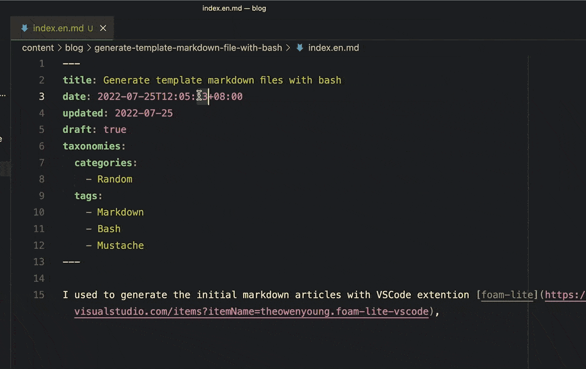
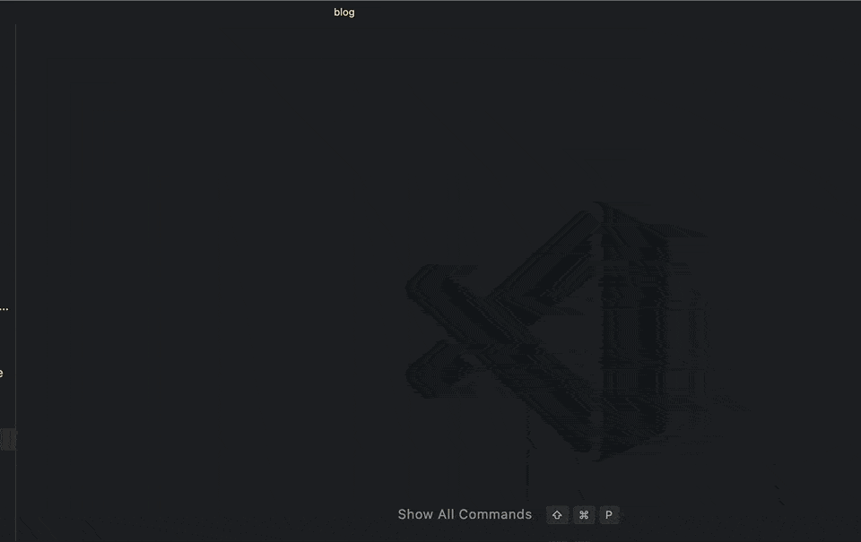
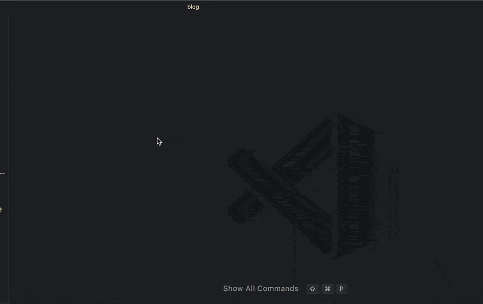

When you're using markdown to write your blog, you can use the following template to generate a new markdown file, you may use some template like this to generate a new markdown file:

<!-- more -->


```yaml
---
title: 
date: ${CURRENT_YEAR}-${CURRENT_MONTH}-${CURRENT_DATE}T${CURRENT_HOUR}:${CURRENT_MINUTE}:${CURRENT_SECOND}+08:00
updated: ${CURRENT_YEAR}-${CURRENT_MONTH}-${CURRENT_DATE}
draft: true
taxonomies:
  categories:
    - Random
  tags:
    - 
---
```

I used to generate these markdown articles with VSCode extention [foam-lite](https://marketplace.visualstudio.com/items?itemName=theowenyoung.foam-lite-vscode), which is like this:



The problem is that it's an VSCode extention, not an general tool, and the tool also has a little limitations.
for example, the default generated file path is based on the current directory, so I always need to navigate to the correct directory to generate the markdown file.

And recent days, I started to use [Dotfiles](https://github.com/theowenyoung/dotfiles) to manage all my configuration files, and I used a lot of bash scripts to manage my dotfiles. So why not to use bash scripts to generate the initial markdown files? It's general enough, and it's easy to use, and it can be reused in any editors.

Here is the final workflow for creating a daily markdown file:



Here is the workflow for creating a normal post:



## How to do this?

I use [Bash Mustache](https://github.com/tests-always-included/mo) as the template engine, it's simple but powerful, and it's just a simple bash file, I place it in my blog repo `./scripts/mo.sh`, then I write an function in `./scripts/common.sh`

```bash
#!/bin/bash
export CURRENT_YEAR=$(date +%Y)
export CURRENT_MONTH=$(date +%m)
export CURRENT_DATE=$(date +%d)
export CURRENT_HOUR=$(date +%H)
export CURRENT_MINUTE=$(date +%M)
export CURRENT_SECOND=$(date +%S)

# template functions
function template() {
  template_path="$1"
  target_path="$2"
  target_dir="$(dirname $target_path)"
  # check target dir is exist, if not, create it
  if [ ! -d "$target_dir" ]; then
      mkdir -p $target_dir
  fi

  # check target file is exists
  if [ -f $target_path ]; then
      echo "$target_path file exists"
      exit 1
  fi
  cat $template_path | ./scripts/mo.sh > $target_path
  echo "$target_path created!"
}
```

For daily journal article(`./scripts/daily.sh`):

```bash
#!/bin/bash
source ./scripts/common.sh
template_path="./scripts/templates/daily.md.tmpl"
target_path="./content/blog/journals/$(date +%Y-%m-%d).md"

template $template_path $target_path;
code $target_path;
```

This script will create a file named `./content/blog/journals/2022-07-25.md` with the `./scripts/templates/daily.md.tmpl` template:

```bash
---
title: {{CURRENT_YEAR}}-{{CURRENT_MONTH}}-{{CURRENT_DATE}}的各种链接
date: {{CURRENT_YEAR}}-{{CURRENT_MONTH}}-{{CURRENT_DATE}}T{{CURRENT_HOUR}}:{{CURRENT_MINUTE}}:{{CURRENT_SECOND}}+08:00
updated: {{CURRENT_YEAR}}-{{CURRENT_MONTH}}-{{CURRENT_DATE}}
draft: false
taxonomies:
  categories:
    - Journal
  tags:
    - Journal
---
```

For convinient to use, I also add a alias in `Makefile`:

```Makefile
.Phony: daily
daily:
	./scripts/daily.sh
```

So if I want to generate a new daily article, I just need to run `make daily`

Or, If I'm in VSCode, I created a task for VSCode in `.vscode/tasks.json`:

```json
{
  "version": "2.0.0",
  "tasks": [
    {
      "label": "daily",
      "type": "shell",
      "command": "make daily",
      "presentation": {
        "reveal": "silent",
        "close": true
      }
    },
    {
      "label": "random",
      "type": "shell",
      "command": "./scripts/random.sh ${input:filename}",
      "presentation": {
        "reveal": "silent",
        "close": true
      }
    },
    {
      "label": "notes",
      "type": "shell",
      "command": "./scripts/notes.sh ${input:filename}",
      "presentation": {
        "reveal": "silent",
        "close": true
      }
    },
    {
      "label": "book",
      "type": "shell",
      "command": "./scripts/book.sh ${input:filename}",
      "presentation": {
        "reveal": "silent",
        "close": true
      }
    }

  ],
  "inputs": [
    {
      "type": "promptString",
      "id": "filename",
      "description": "You article path.",
      "default": "",
    }
  ]
}
```


All source codes are in my blog [repo](https://github.com/theowenyoung/blog)