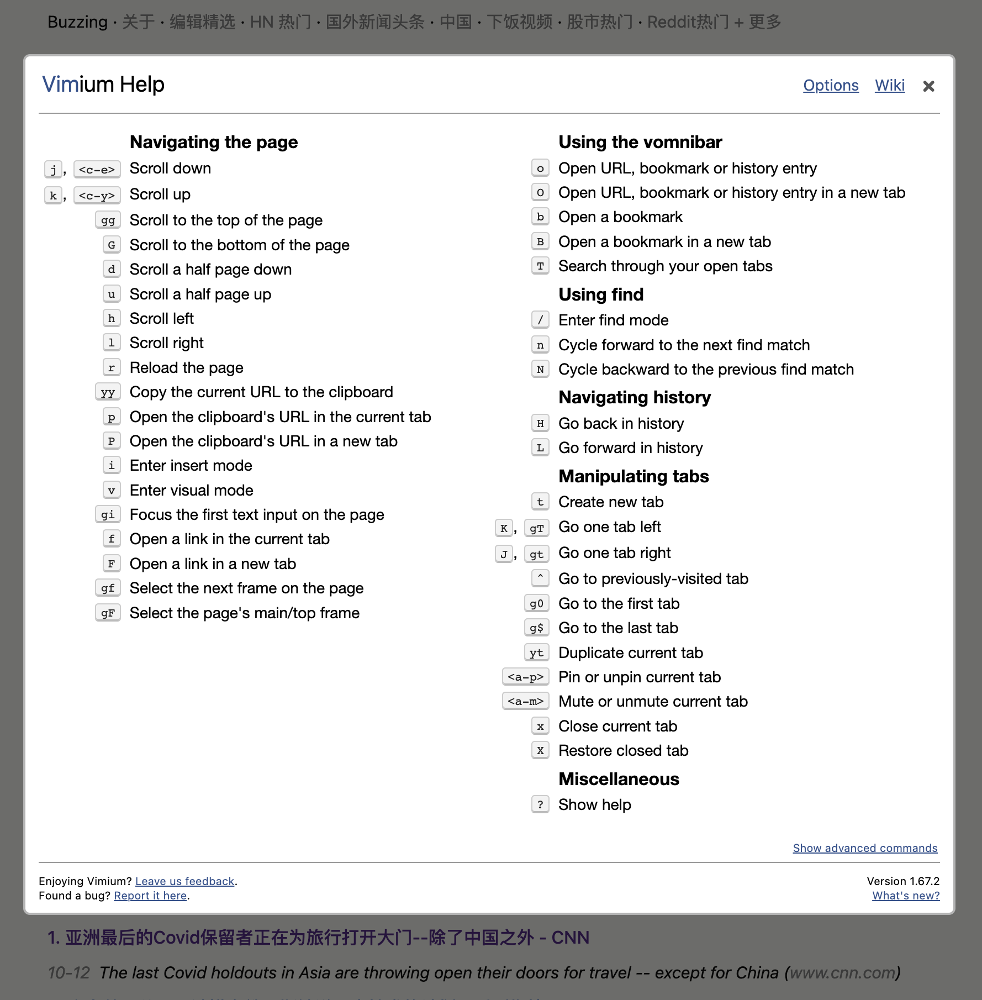

我发现互联网上真正改善生产力的东西总是开源和免费的，反而小众的东西，要么体验欠佳，要么是需要付费。就像阿莫西林胶囊对比“天价“救命药一样，因为更多人需要，所以总有更多人进入这一领域生产出更好用的东西。

最近让我产生这个感觉的是一个叫 [Vimium](https://github.com/philc/vimium)
的浏览器插件，使用近一个月后，我发现在浏览器上使用 Vim
模态快捷键的场景比在编辑器中使用 Vim 模式还要高。而且它比 vim 编辑器的门槛低了一个数量级，你完全可以仅使用它，而不使用 Vim 编辑器。

<!-- more -->

> 前情提要：我大约在一个月前开始学习使用模态编辑器，一开始是用 [Kakoune](https://kakoune.org/)
> ,因为我喜欢它的新手友好性，以及它[相对 vim 改进的设计模式](https://twitter.com/OwenYoungZh/status/1574805501489319936)，试用一周后，发现其还是不能真正的生产可用，有些编辑体验有瑕疵，可选择的插件不多，最重要的是没有
> [Copilot 插件](https://discuss.kakoune.com/t/is-anyone-interested-in-writing-github-copilot-plugin/2131)，
> 所以我最终还是开始用 neovim
> 作为我的主力编辑器，使用[nvchad](https://github.com/NvChad/NvChad)作为初始配置让我更好的入门。

Vim 的核心理念是模态编辑，它认为我们在使用代码编辑器的时候，真正插入字符的场景比我们在代码之间导航，选中之类的操作要少，所以在 Vim
编辑器中，插入模式只是其中的一种模式，最重要的模式是 Normal 模式（可以上下移动光标，快捷删除，快捷复制粘贴等等），以及辅助的 visual
模式（可以进行各种纬度的选中操作，比如选中当前括号内的，选中到开头，到结尾等等）。我切换到 Vim 编辑器后感触最深的是 visual 模式下的各种操作，比如按`i"`可以选中当前双引号内的字符，按`i(`就可以选中当前括号内的内容，然后可以按`d`删除，或者`y`复制，或者`c`删除并进入插入模式。

随后我发现了这个叫 [Vimium](https://github.com/philc/vimium)
的浏览器插件，使用之后就一个感觉，就是前十年的冲浪生涯白过了，就和我学双拼之后的感觉一样。

我惊奇地发现原来浏览器才是模态编辑最适合的地方啊，浏览器，浏览器，顾名思义，它的主要作用就是浏览啊，所以在浏览器中。我们绝大多数时候都处于 相当于 Vim 的 normal
模式。想想看我们在浏览器上真正花在输入的时间有多少？大多数时间都是在翻页，前进，后退，切换 tab 页之类的，有人说那浏览器也有快捷键啊，没错，但模态编辑器的核心思想就是用更少的击键次数去做最常用的操作，人生不值得浪费双倍的力气在击键上。而且，最重要的是，当我开始在浏览器中使用 Vim 模式的时候，我会下意识的寻找常用操作对应的击键，按下`?`即可显示所有的键位。而没在用 vim 模式之前，都是鼠标是键盘来回切换的。

下面这个是 Vimium 的默认键位配置：



其中我最常用的键位是：

| 键  | 对应的操作                                |
| --- | ----------------------------------------- |
| j   | 下翻                                      |
| k   | 上翻                                      |
| gg  | 回到顶部                                  |
| G   | 回到底部                                  |
| ?   | 打开帮助页面                              |
| H   | 返回上一页                                |
| L   | 前进一页                                  |
| x   | 关闭当前页面                              |
| J   | 去左边的 tab 页                           |
| K   | 去右边的 tab 页                           |
| f   | 进入 link 模式                            |
| F   | 进入 link 模式，但是是在新标签下打开 link |
| /   | 进入搜索模式                              |
| yy  | 复制当前页面的 url                        |
| p   | 打开当前剪贴板的 url                      |
| i   | 退出 vim 模式                             |
| esc | 进入 vim 模式                             |

我修改了其中几个默认配置：

```
map J nextTab
map K previousTab
map a LinkHints.activateModeToOpenInNewTab
```

> 因为我的浏览器 tab 也是竖向排列的，所以 J 更适合作为下一个 tab 页，K 更适合作为上一个 tab 页面，但如果浏览器标签是横向排列的话，那 J 在左边，K 在右边，可能更直观。
>
> 另外就是我经常需要用后台的新 tab 页打开链接，所以我把 a 键 作为 F 的别名。

当然，还有一些快捷键由于肌肉记忆，我是用组合键的，比如打开一个新标签页`cmd+t`

`f`或`F`是 vim 模式的一个大杀器，真正解放了鼠标，比如我在浏览[Buzzing](https://www.buzzing.cc)或者 Google 的时候，按下`f`键，页面上所有可见的链接都会被分配到一个好按的键位，这个时候按下相应的键位，就会打开对应的链接：


当我习惯这个操作之后，发现这比用鼠标操作的效率高了不少。尤其我是[Buzzing](https://www.buzzing.cc)的重度用户，buzzing 上的各种链接非常适合用键盘进行导航和浏览，极大的提高了我浏览 buzzing 的效率。

Vimium 插件提供了[Chrome](https://chrome.google.com/webstore/detail/vimium/dbepggeogbaibhgnhhndojpepiihcmeb)和[Firefox](https://addons.mozilla.org/en-GB/firefox/addon/vimium-ff/)的版本，了解更多，请点击它的[项目主页](https://github.com/philc/vimium)

更多操作你可以自己去探索，另外还有一个类似的插件叫[Surfingkeys](https://github.com/brookhong/Surfingkeys), 据说更强大，但是我看了一眼似乎更复杂，我觉得这个 vimium 已经足够我用了，欢迎进入 mouseless 世界！
