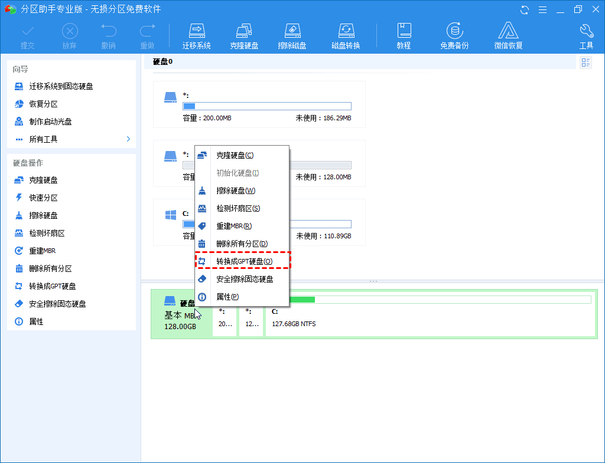
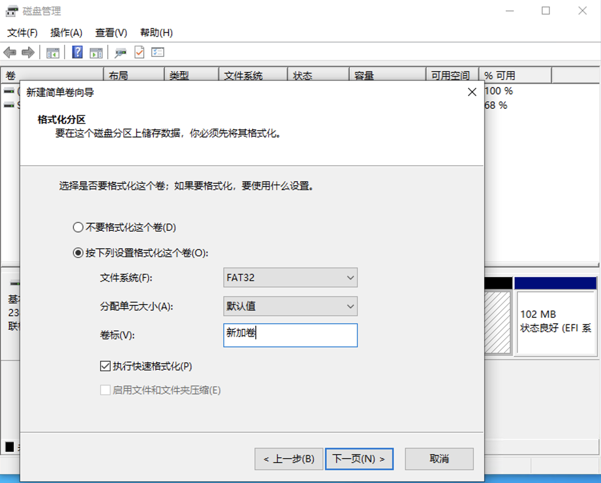

这篇文章是一篇笔记，记录一下安装期间遇到的坑，不算是教程，因为我走了一遍流程之后决定放弃这样安装，还是乖乖的买一块新的 U 盘去安装系统，劝你也这样做（我为啥要这样装系统，是因为我的旧 U 盘是一个 360wifi 的 u 盘，试了用[refus](https://rufus.ie/en/),[ventoy](https://www.ventoy.net/en/faq.html)等工具创建引导 u 盘，电脑都无法启动这块 u 盘的引导系统，这才尝试无 U 盘安装）。

> 背景是：最近刚搬家，无意中找到一个 dp 的转接头，神奇的发现之前屏幕坏掉的 Thinkpad T450 笔记本可以外接到房东的大电视上显示，（之前拿到联想售后店，售后告诉我整个显卡都坏掉，外接显示屏也无法显示，我也就没尝试过），所以准备给这台旧笔记本额外安装一个 Linux 系统，用作家庭服务器，可以跑旁路由，和一些媒体中心等等。这样的需求最适合装一个 headless 系统，平时都通过 ssh 连接和操作，把废旧笔记本当作树莓派一样用。

我发现装系统的时候最能学到一些更底层的知识，我虽然是程序员，但还是有超多基本知识都不了解，通过这次装系统，又学了好多新知识。在查找教程的过程中，有一点感触很深，就是写教程的人，最好解释清楚每一步操作都干了啥，这样读者才能从中学到真正的东西，但是网络上有很多中文的教程就只是告诉你说这几行命令能解决问题，这就搞得人很虚。所以自己写教程或者笔记的时候，一定不要怕冗余，努力说清楚每一个操作实际上干了什么。

装完之后，总算理解了一点点电脑的启动流程，写了一篇笔记：[电脑的启动流程](@/blog/booting/index.md)

<!-- more -->

> 下面文章里提到的很多名词，我会默认你已经读过上面这篇操作系统启动的综述了，所以就不再重复解释。
>
> 这篇文章是靠回忆完成的，所以可能会有一些步骤的遗失，如果你遇到问题，欢迎帮助我一起编辑这篇文章。

## 1. 关闭快速启动

电源选项 -> 选择电源按钮的功能 -> 更改当前不可用的设置，取消勾选启用快速启动.这样电源按钮就恢复为单纯的电源按钮了。

> 快速启动是 Windows 把传统的完全关机模式，升级为“关机+休眠唤醒”的混合启动模式。在传统的关机模式中，执行关机命令后，Windows 会彻底结束正在运行的应用程序、停止系统服务、注销登录用户账户、关闭计算机电源，而不刷入缓存、写入文件。故下次开机时，所有资源项都必须重新启动一遍、全新加载、全新读取，因而在进入桌面后，仍会有一段的等待加载时间(体现在鼠标转圈圈)。而在“快速启动”模式下执行关机，Windows 8、8.1、10 等系统版本会将系统当前的运行状态(包括进程、服务、会话、内核等)写入到休眠缓存文件中，待下次开机时，系统便直接读取该休眠文件，并将其加载到内存，从而实现快速唤醒、快速恢复、快速启动，故等待时间较短，所以有些时候关机前没有关掉的窗口开机后可能会再次出现。

## 2. 转换分区格式 MBR 到 GPT

我的笔记本的主板是用的 UEFI，但是它的默认设置却用了 Legacy boot 的模式，磁盘也是使用 Master Boot Record (MBR)作为分区格式。这是一种过时的配置，所以第一步，我就把整个电脑的分区格式从 Master Boot Record (MBR)改为 GUID Partition Table (GPT) 格式，全面 UEFI 化。这一步其实很底层，有可能丢失数据，但是我的电脑啥都没有，所以我不担心这个问题，如果你有重要数据，请一定做好备份。我使用[傲梅分区助手](https://www.disktool.cn/)把整个磁盘转换为 GPT 格式，我只有一个磁盘。



转换完成之后，重启系统，按 F1 进入 UEFI 的 Boot 设置菜单,把 Boot Mode 改为 UEFI，同时确认 Security Boot 是关闭状态，CSM 也是关闭状态。

> Security Boot 开启后，uefi 将会用公钥验证操作系统是否由认证的厂商发型，当时好像只内置了 Windows，Ubuntu 的支持，所以其实我觉得爱折腾的人，家用电脑没必要开启这个选项
>
> CSM（兼容性支持模块）,因为我们全面使用 UEFI，所以关闭 CSM 的支持，CSM 用于支持 MBR 引导


## 3. 磁盘划分

开机后，使用 Windows 的磁盘管理工具，新建一个 8G 左右大小的 FAT32 格式的分区，用于代替 U 盘，存放 Ubuntu 的系统镜像文件。



然后在[Ubuntu Server 的下载页面](https://ubuntu.com/download/server), 下载最新版的 Server 镜像文件，然后把镜像文件解压到这个分区里。注意是把根目录的所有文件解压进去，不带根目录

解压完成之后，我们需要修改一个 grub 的引导启动项参数, 找到`boot/grub/grub.cfg`文件，然后用记事本打开，找到以下行：

```bash
menuentry "Try or Install Ubuntu Server" {
	set gfxpayload=keep
	linux	/casper/vmlinuz  ---
	initrd	/casper/initrd
}
```

修改为：

```bash
menuentry "Try or Install Ubuntu Server" {
	set gfxpayload=keep
	linux	/casper/vmlinuz toram  ---
	initrd	/casper/initrd
}
```

我们添加了一个`toram`参数，这个参数告诉 grub 把整个 ubuntu 系统加载到内存中，这样我们就不依赖硬盘了，也就能在安装的过程中操作硬盘了。

## 4. 新建系统引导项

下载 [EasyUEFI](https://www.easyuefi.com/index-us.html) 软件，进入系统启动项管理，点击新建启动项，名字可以叫`ubuntuinstaller`,选择你刚新建的 Fat32 分区，引导文件选择`EFI -> BOOT -> grubx64.efi`，使用 grub 来引导，然后确定即可。这样就创建了一个启动盘，代替 U 盘。

## 5. 新建 ubuntu 的分区

接着再分出一个 80GB 左右的磁盘空间，用于安装 ubuntu 系统，具体操作是在磁盘管理里，先压缩 C 盘，压缩出大概 80G 的空间，然后把这个空间格式化为 nfts 格式

> 如果不格式化成 nfts 格式的话，ubuntu server 的安装程序无法发现未分配的磁盘，所以这一步先随便格式化一下，到时候安装的时候再让 ubuntu 安装程序格式化成 ext4 格式

## 6. 安装 ubuntu

重启电脑，按 F12 选择启动项，选择刚刚创建的`ubuntuinstaller`启动项启动，这时会进入 grub 的引导菜单，选择`Try or Install Ubuntu Server`,接下来就按照菜单里的提示一步步来，到了 disk 选择那一步要注意：


这一步要选择 Custom Storage layout, 然后选择你刚创建给 ubuntu 的分区，进入`edit`菜单，`Format`选择`ext4`格式，Mount 选择`/`即可，其他的设置根据自己的喜好来就好。

## 7. 完成安装

我的电脑完成安装后，好像会丢失 windows 的 UEFI 一级引导项，但是 grub 作为二级引导程序， 会在这里加上 Windows 的引导，开机后按`esc`键会进入 grub 的系统选择菜单，在这里可以进入 Windows，然后可以再打开 EasyUEFI，好像打开一下，它就会修复一级系统引导了，这样之后按 F12 就可以选择不同的系统了。另外完成安装后，就可以删除磁盘里的 ubuntu 安装分区里。

## 8. 卸载 Ubuntu

卸载 Ubuntu 很简单，进入 Windows 系统后，直接删除 ubuntu 的分区磁盘，然后在 easyuefi 软件里也删除 ubuntu 的启动项即可。
