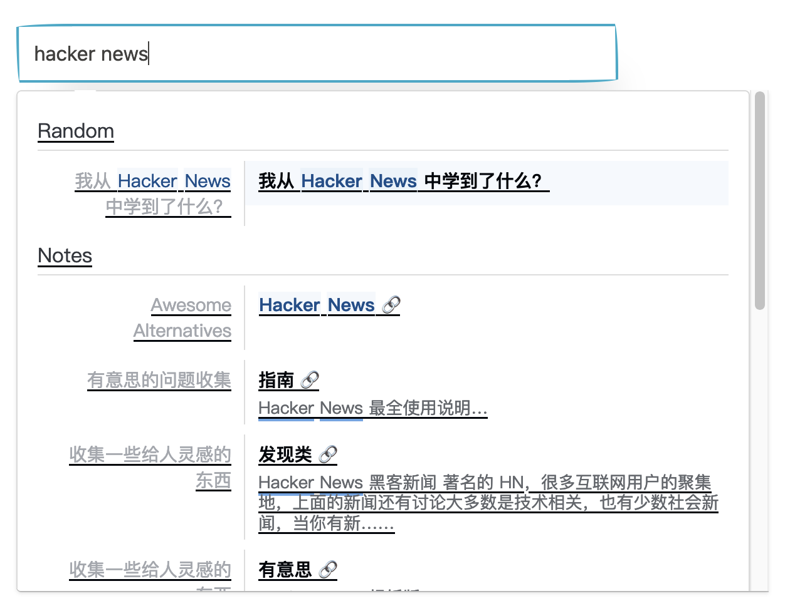
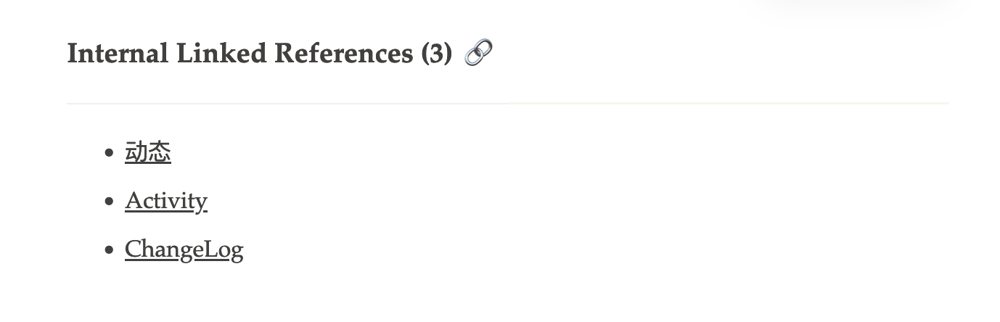
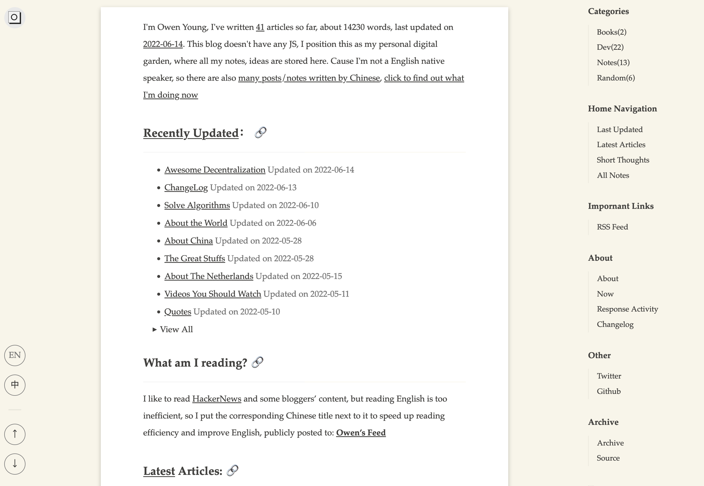
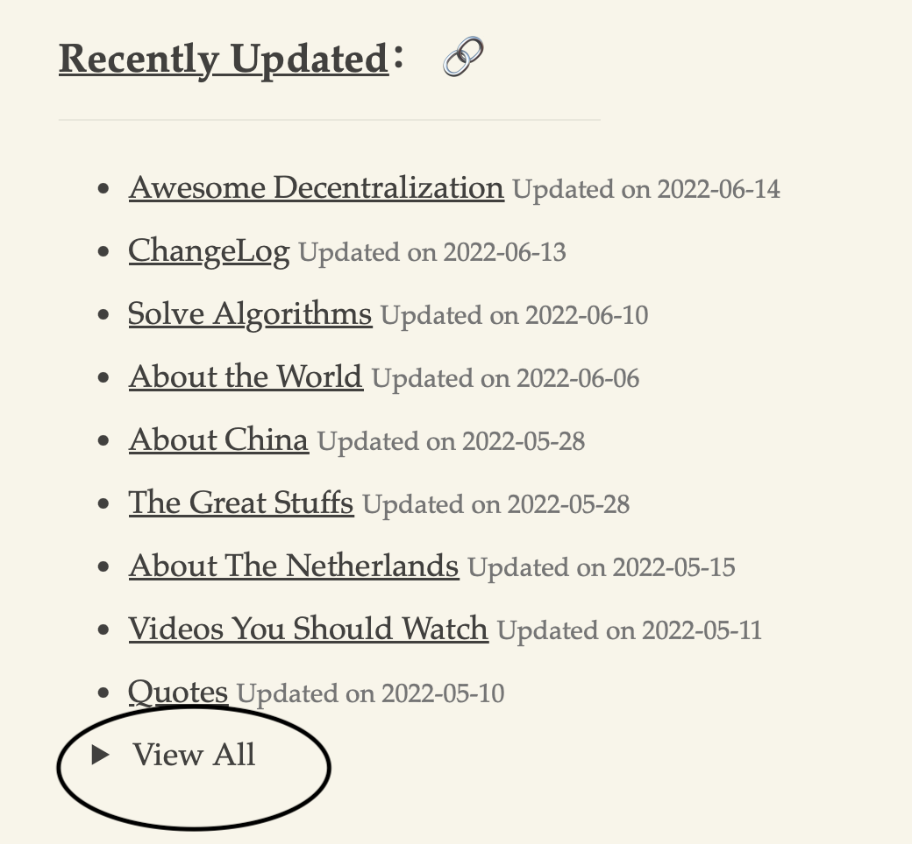
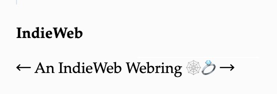
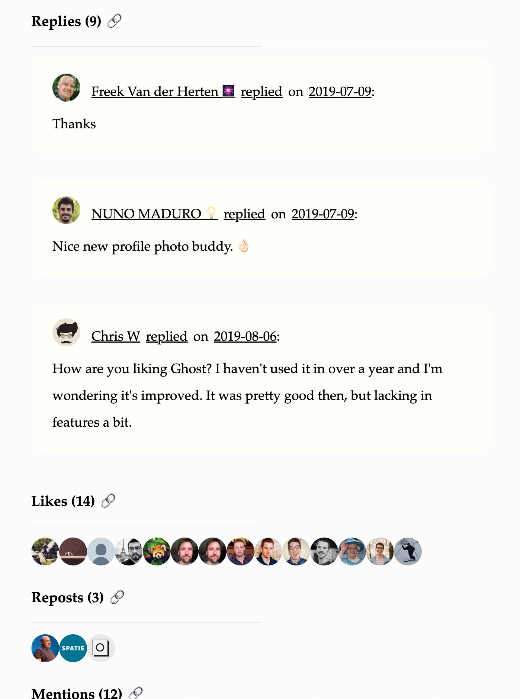
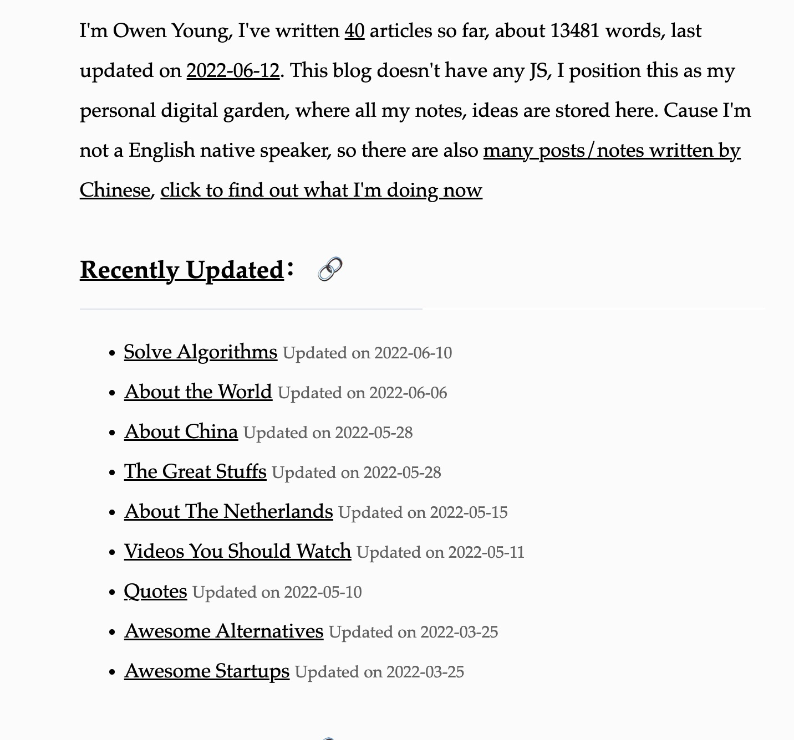
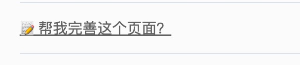
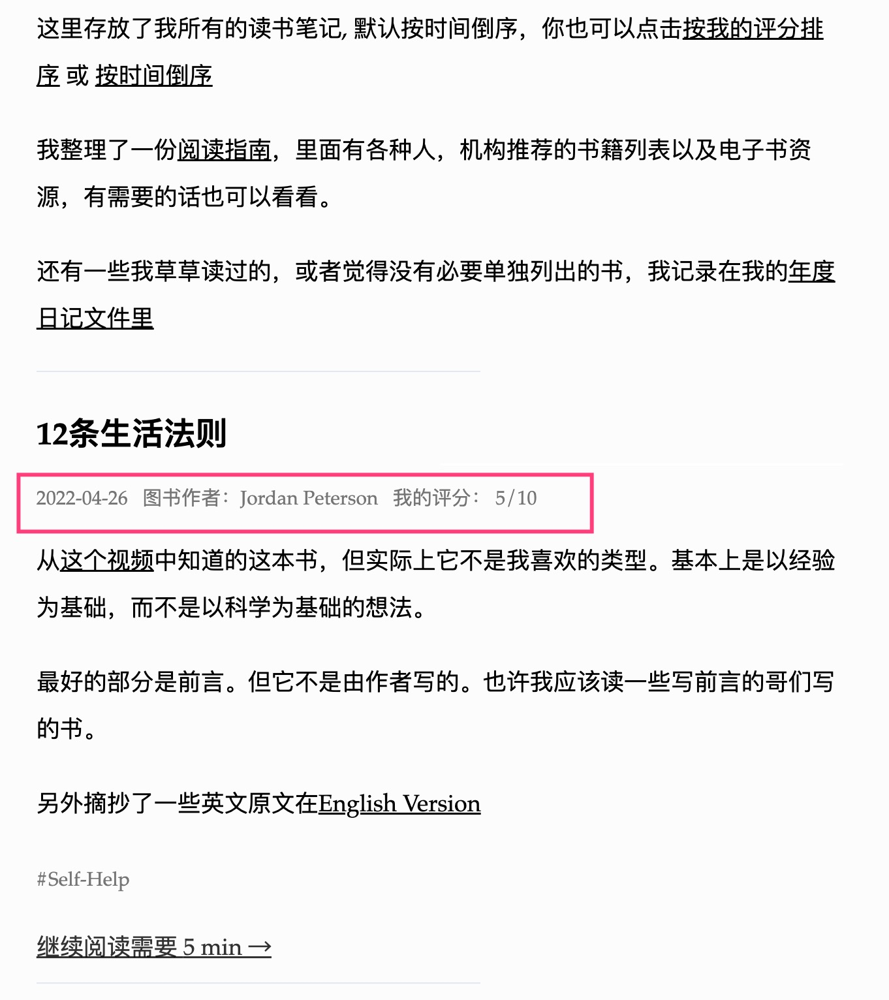

All Updates about this blog.

<!-- more -->

## 2023.06.14 Remove nav bar

## 2023.06.10 Remove Activity Page

For the heavy building times, like 250s.

## 2022.10.20 og:img use asset image

use asset image as the default og:img

## 2022.10.10 Blockquote ui

from `|` to `"`

## 2022.09.01 Show short title

Show short title for all posts in home page:


## 2022.07.25 Support Tweet Reply

Show tweet reply:


## 2022.07.18 Inline Style

For better performance, I have inline my pages css;

```html

<style>
  {{css | safe}}
</style>
```

Also, for better performance, docs search css will be loaded defer:

```html
<link rel="preload" href="{{ get_url(path="site/styles/docs-searchbar.min.css",
trailing_slash=false,cachebust=true) | safe }}" as="style"
onload="this.onload=null;this.rel='stylesheet'">
<noscript>
  <link rel="stylesheet" href="{{
  get_url(path="site/styles/docs-searchbar.min.css",
  trailing_slash=false,cachebust=true) | safe }}"></noscript
>
```

## 2022.07.12 Change Surface Background Color

Now it looks like this:


## 2022.07.12 Support Search

Powerd by [Meilisearch](https://github.com/meilisearch/meilisearch)



## 2022.07.09 Support backlinks.



## 2022.07.09 Fix large building time

I wrote a heavy logic in the `base.html` template, this can increase much
building time, actually the logic is only dependent by two page, so I move it,
now the building time is about 1 second again, also
[see here](https://github.com/getzola/zola/issues/1902#issuecomment-1178845667)

## 2022.07.06 Desktop Read Mode

when screen width greater than 67.5rem, then set the background color of main
area as white, it's like the safari reader mode, can be more focus to the
reader. 

## 2022.07.03 Decrease Base fontsize

Change base font size to 15px

## 2022.06.30 index toggle more button

Add Toggle More Button.



## 2022.06.18 refactor sidebar/archive

Migrate `sidebar/_index.md` to `pages/sidebar.md`, all spectified page located
in `content/pages` directories.

## [2022.06.14](https://github.com/theowenyoung/blog/commit/7a87eb29b6e3eaafdae14488a8f42de817073f3f) - Activity Page

Adding Activity page.

## [2022.06.13](https://github.com/theowenyoung/blog/commit/c20bb4c97540e91ed2f555800d36ebbe05379155) - IndieWeb

1. Support [IndieAuth](https://indieauth.net/)

2. Joining [IndieWeb Webring](https://xn--sr8hvo.ws/), See home page bottom
   right corner



3. Support [Webmention](https://indieweb.org/Webmention), see example
   [Now, I'm in IndieWeb?](/content/blog/indieweb.en.md)



## [2022.05.14](https://github.com/theowenyoung/blog/commit/cb7e8ec8cc115a35948906c2c91679826e561c79) - Latest Updates

Add Latest Updates to home page.



## [2022.04.25](https://github.com/theowenyoung/blog/commit/ebe57d4b3717c5052ea3319e8e1f04e9d7b80153) - Random Category

Change category `Misc` to `Random`, I prefer `Random` than `Misc`, cause I even
don't know what `Misc` is. It's inspired by
[Pin 起來](https://pinchlime.com/categories/random/)

## [2022.04.24](https://github.com/theowenyoung/blog/commit/cfc2b4dc4c96c1e16e8f4a257da2d30b254f8afc) - SEO

Add `og:title`,`description` to pages for better SEO.

## [2022.04.08](https://github.com/theowenyoung/blog/commit/06f1d35a7a5a8e4c97d4189cf3204b4b7c4bdea2) - Edit Link

Adding Edit this article link to every post.



## [2022.03.29](https://github.com/theowenyoung/blog/commit/0f8244f2e8a8799ce6b6cbd82914db734af33f30) - Birthday

1. Today is this blog's birthday, and I'm happy to announce that I've migrated
   from [Wiki](https://wiki.owenyoung.com/) and
   [Blog](https://blog.owenyoung.com/) to
   [New Blog](https://www.owenyoung.com/). The Blog is built with
   [Zola](https://www.getzola.org/), I also wrote
   [迁移博客和 Wiki 到 Zola](/content/blog/migrate-to-zola/index.md) to record it. The
   biggest difference is the blazing building speed of Zola, for now, it only
   takes 2 seconds to build the whole site.

2. Support [读书笔记](/content/blog/books/_index.md) Templates, show my review score
   of the book, and show [Books Sort By Rating](/content/pages/books.md)


