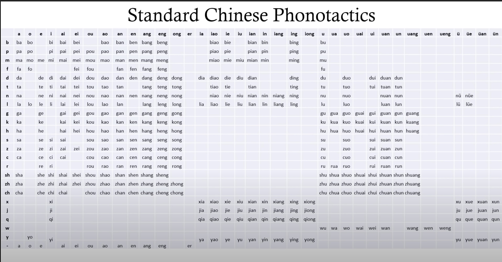

Curating opnions and things about China.

<!-- more -->

## Videos

- [Why India is Better than China](https://www.youtube.com/watch?v=9avzTVVjnZw) - The most knowledgeable foreigner in China I have seen so far, about the censorship, and dishonest in China.

## Chinese Language

To speak Chinese is not hard, because the most common words are two syllables, so it's easy to remember. The hard part is the characters. There are more than 2000 common characters in Chinese.
