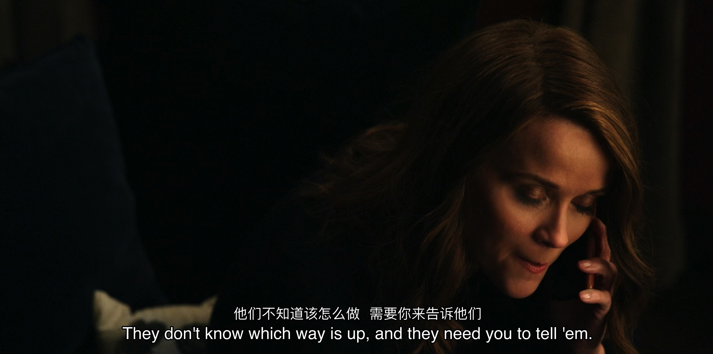
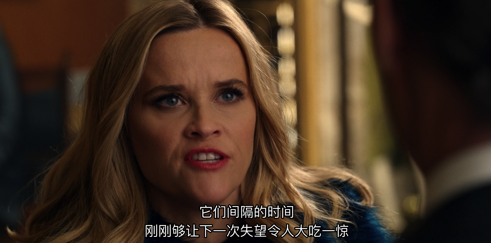

> 一个穷人什么时候有时间发疯啊

收集影视剧的截图。

<!-- more -->

1. 

> -- 《早间新闻》S01E09

2. 

> -- 《梦幻骑士》1972

3. > 如果人们不知道你在做什么，那么他们就不知道你做错了什么。 -- 《是，大臣》S01E01

4.  

> 事实证明，生活就是一系列令人失望的事，它们间隔的时间刚刚够让下一次失望令人大吃一惊。 -- 《早间新闻》S02E02
