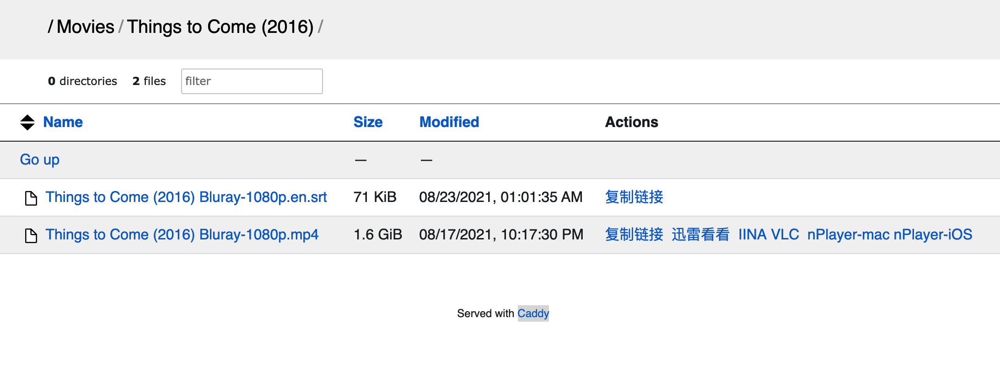

记录自己看过的电影，按年份排序，星星 ✨ 是我自己的评分，如有笔记则另外链接。基本上从 2021 开始记的，以前的由于没有及时建立这个第二大脑，基本都忘的差不多了。

<!-- more -->

Also see [电视剧笔记](@content/tv-shows/index.md), [读书笔记](@content/blog/books/_index.md)

## 其他人的推荐列表

- [美国电影协会：有史以来最伟大的 100 部美国电影](https://www.afi.com/afis-100-years-100-movies/)

## 资源

- [免费的版权到期电影](https://cinetimes.org/)
- [查看相似的电影](https://proximovie.com/)

## workflows

目前主要是用 [qBittorrent setup for Debian](@content/blog/qbittorrent-setup-for-debian.en.md),[Jackett Setup](@content/blog/jackett-setup.md)载电影，买了一台 1T 的 VPS 作为 NAS。本来想用[Jellyfin 安装](@content/blog/jellyfin-setup.md)为影视中心的，但是使用后感觉客户端并不是 native 的，略卡，可能暂时还不胜用，所以索性直接上[Caddy File Server Browser with URL Scheme](@content/blog/caddy-file-server-browser-with-url-scheme/index.en.md), 然后 mac 用 [IINA](https://iina.io/)，或者[迅雷看看](https://video.xunlei.com/)（大多数剧的字幕匹配做的好一点），手机端用 [nplayer](https://nplayer.com/)或[VLC](https://www.videolan.org/) 打开流文件。目前这样的体验是最爽的。

## Todo

- [Dark City](https://www.imdb.com/title/tt0118929/) - 类似黑客帝国，但是更早

## 人生必看系列

这里放我自己觉得必看的一些电影：

- 黑客帝国
- 智利说不
- 谋杀绿脚指
- 人猿星球
- 地下
- 蝙蝠侠

## 2024

- [x] 小武 ✨✨✨✨
- [x] 三峡好人 ✨✨✨✨
- [x] 帝国的毁灭 ✨✨✨
- [x] 芝加哥 ✨✨✨✨
- [x] 坠楼死亡的剖析 ✨✨✨✨
- [x] 卡比利亚之夜 ✨✨✨✨
- [x] 周处除三害 ✨✨✨

## 2022

- [ ] 《玛丽与马克思》，✨✨✨，木偶动画片，全剧以一种娓娓道来的故事在讲述一位来自澳大利亚的女孩与远在美国纽约的社会边缘人的通信往来。适合性格比较感性的同学观看（我没有看完，因为是分为两次看的，第二次 partner 自行观看，然后我自己好像又没动力继续一个人看完）
- [x] 《死亡诗社》，✨✨✨✨，讲述了美国一家精英贵族学校里新来的一位男老师为受到教育体制，父母的强烈影响下的学生们播下了独立思考的种子。如果再年轻的时候看这部片子的话，我会很受用，但是现在的年纪好像看了，也就是看了，没有想象中的那种精神震动了。
- [x] 《不可饶恕》，✨✨✨，美国西部片，讲述了 1880 年左右的一位退休赏金猎人的再次出山。不过现在的我不是很能共情这样的“英雄”了。
- [x] 《卡萨布莱卡>,✨✨✨✨, 1942 年的片子，当年德国已经入侵了法国，卡萨布莱卡当时是法属摩洛哥的首都，很多欧洲人会选择这里作为逃亡美国的中转站，影片讲述了开在这里的一间酒吧发生的战争期间的爱情故事。虽然有一点逻辑在现在看来有点过于戏剧化，但是作为 1942 年的片子，各方面来说都是顶级作品。推荐。
- [x] 《穿靴子的猫 2》，✨✨✨✨✨，很不错哎，超出预期，相对于 1，讲了了一个不一样的故事。最近疫情高峰，影院人很少，几乎相当于包场，很爽的一次体验，对于动画片，没有小孩的干扰！
- [x] 《阿凡达 2》，✨✨✨，好吧，我承认我对特效并不感兴趣，我更喜欢故事。
- [x] [地下](https://movie.douban.com/subject/1292206/) , ✨✨✨✨✨，后现代荒诞喜剧，讲述了南斯拉夫的历史。开头很惊艳，随后有点无聊，但是 1 小时后，每一分钟都很精彩，强烈推荐！
- [x] 谋杀绿脚趾，✨✨✨✨✨，喜剧，太好看了，以前看过，昨天翻硬盘的时候看到又看了一遍。最后一幕太经典了。推荐所有人看。
- [x] 华氏 451 度，2018，✨✨✨✨，豆瓣 5.5 分，但是对于看过原著的人来说，电影是一个非常好的补充，电影在影视方面拍的很不错，情节方面其实老实说，我觉得比原著要好，改编了很多，增加了很多情节和细节。
- [x] 悲惨世界，✨✨✨✨，音乐剧，很享受剧本，但是情节就是有点太刻意。
- [x] 小妇人，✨✨✨✨，之前看过一点小说。“我爱你，但是我觉得除了爱之外我还有更重要的事”。女性力量。

## 2021

- [x] 梦幻骑士, 1972,✨✨✨✨， 戏剧+电影结合的非常好的一部剧，仅节选了原著中的第一个故事，但是结局改的非常感人，唐吉可德救赎了自己的女神。
- [x] 沙丘，2021，✨✨✨✨，看的 imax，不得不说，视觉体验真的贼好，但是由于没看书就看电影，一开始有点懵，后面回去补了书，发现拍的其实很好。
- [x] 芬奇，2021，✨✨✨，有点简单温馨，不太是我的菜。但是也不算浪费时间。
