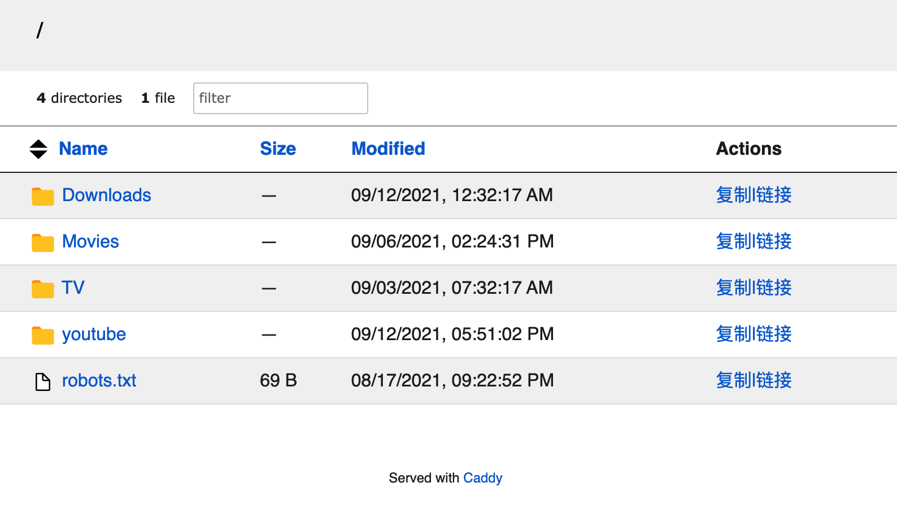
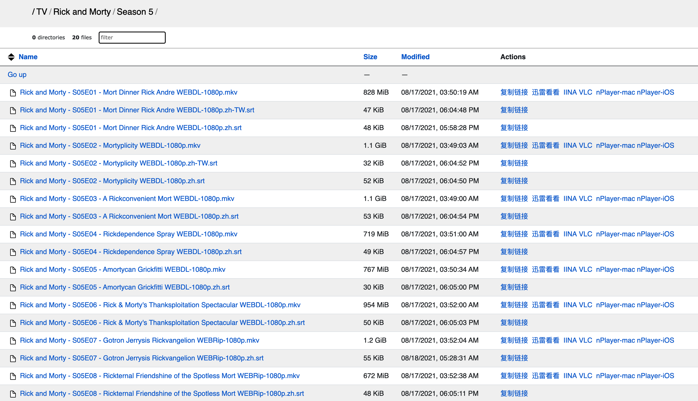

记录自己看过的剧，按年份排序，星星 ✨ 是我自己的评分，如有笔记则另外链接。基本上从 2021
开始记的，以前的由于没有及时建立这个第二大脑，基本都忘的差不多了。有一些剧是看的解说，但是有点后悔，当时是为了节省时间，早知道那么精彩就应该看原剧。

<!-- more -->

Also see [读书笔记](@content/blog/books/_index.md), [电影笔记](@content/movies/index.md)

## 电视剧列表

- [Tomato Tree](https://tomatotree.tv/) - 通过烂番茄网站找到你的下一个电视剧！

## TODO

- [权力的堡垒 第一季 Borgen Sæson 1](https://movie.douban.com/subject/4082095/)
- Deadloch - 女性主义黑色犯罪剧(直接看了解说，好吧，其实也就那样...)
- Ted Lasso - 该剧第一季获得了 20 项艾美奖（Primetime Emmy Awards）提名，成为艾美奖历史上获得提名最多的第一季喜剧。

## 播客 TODO

- [重读共和国历史讲座](https://open.spotify.com/show/6jElob5yuUZNuaGUT5YQaf)

## workflows

目前主要是用
[qBittorrent setup for Debian](@content/blog/qbittorrent-setup-for-debian.en.md),[Jackett Setup](@content/blog/jackett-setup.md),[Sonarr Setup](@content/blog/sonarr-setup.en.md),[Bazarr Setup](@content/blog/bazarr-setup.en.md)
在下载和管理剧以及字幕，买了一台 1T 的 VPS 作为
NAS。本来想用[Jellyfin 安装](@content/blog/jellyfin-setup.md)为影视中心的，但是使用后感觉客户端并不是
native
的，略卡，可能暂时还不胜用，所以索性直接上[Caddy File Server Browser with URL Scheme](@content/blog/caddy-file-server-browser-with-url-scheme/index.en.md),
然后 mac 用
[IINA](https://iina.io/)，或者[迅雷看看](https://video.xunlei.com/)（大多数剧的字幕匹配做的好一点），手机端用
[nplayer](https://nplayer.com/)或[VLC](https://www.videolan.org/)
打开流文件。目前这样的体验是最爽的。

## 人生必看系列

这里放我自己觉得必看的一些剧：

- 绝命律师
- 傲骨之战
- 我的天才女友
- 早间新闻
- 行骗天下
- 大明王朝 1566

## 2024

- [x] 辐射 ✨✨✨✨✨
- [x] 三体 ✨✨✨✨✨

## 2022

- [x] 使女的故事，第五季，✨✨✨✨✨，比第三，第四季拍的剧情要更紧凑，也更爽一点。推荐看过前面的剧的同学看，或者看过原著小说的。
- [x] 傲骨之战第六季，✨✨✨✨✨，一如既往的高质量。
- [x] 我的天才女友， 第三季，✨✨✨✨✨，一如既往的水准。这部剧是我心中排名前三的剧。
- [x] 使女的故事，第一季，✨✨✨✨，推荐先看原著，再看电视剧，不然很可能一头雾水。
- [ ] 南方公园，第 23/24/25 季，✨✨✨✨✨，喜欢这种紧跟时事的讽刺性作品。要是中国也能出这类作品就好了。

## 2021

- [x] 黑道家族，共六季， ✨✨✨✨，颠覆对黑道剧的想象。
- [x] 傲骨之战，第五季，✨✨✨✨✨，神剧，第五季紧跟时事，对新冠疫情，直播，言论自由，冗长的体制进行了深刻的探讨。人生必看。
- [ ] 瑞克与莫蒂，第五季， ✨✨✨✨，还行，但是有一点套路化了，没有第一季的惊喜了。
- [x] 早间新闻，第一季，✨✨✨✨✨，全剧在多方面探讨了 Metoo
      的影响，剧情也很精彩（虽然有部分地方有点戏剧化，但是不影响），有很多地方看的很揪心。反正在我看来这部剧就是既深刻又精彩。期待第二季。
- [x] 半泽直树，第二季，✨✨✨✨，日本剧总感觉有那么一点含蓄，等级森严。虽然第二季引入了女性角色，但是还是有点不够饱满。
- [x] 行骗天下，✨✨✨✨✨，五星推荐，日本神剧，每一集都反转反转再反转，精彩！
- [x] 法官大人，✨✨，绝命毒师里的老白主演，但是后面剧情越来越烂尾，不推荐。
- [x] 致命女人，第二季，✨✨✨，前面很精彩，但是后面走向有点套路。
- [ ] 新闻编辑室，第一季，✨✨✨，看了 10
      来集，暂时弃剧了，主要是里面的情感关系和幽默让我有点看《硅谷》的感觉，感情有点太脸谱化，幽默就更脸谱化了，笑不出来，深刻是有，但是如果只有深刻，没有剧情，就有点看不下去。
- [x] 太空堡垒卡拉狄加，✨✨✨，第一季+第二季，后面几季没看了，按现在的眼光来看有点套路，然后又有点太男女主光环，以及有点 迷信？
- [ ] 是大臣，全三季，✨✨✨✨✨，五星推荐，英式情景喜剧，每一集一个主题，对英国政治运作的吐槽。非常到位。

## 2020

- [x] 我的天才女友，✨✨✨✨✨，神剧
- [x] 银河英雄传说，✨✨✨✨✨，动画长剧，后悔小时候没看，神动画剧，很宏大的宇宙世界。正反派都刻画的非常好。
