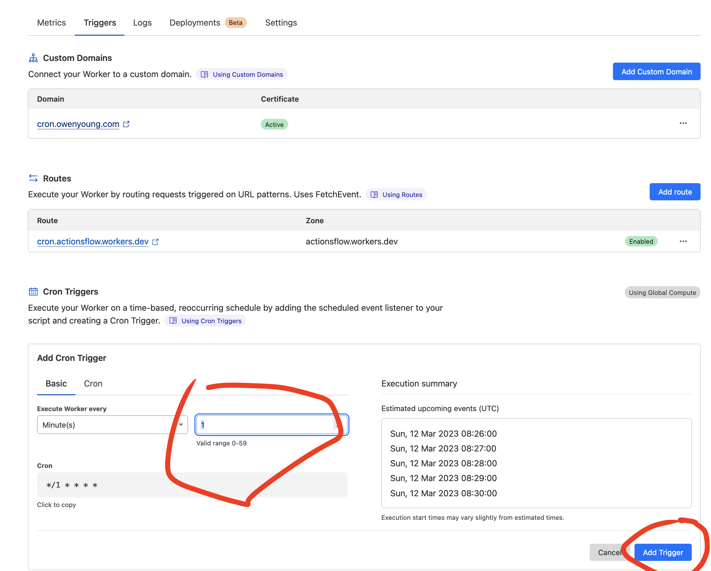
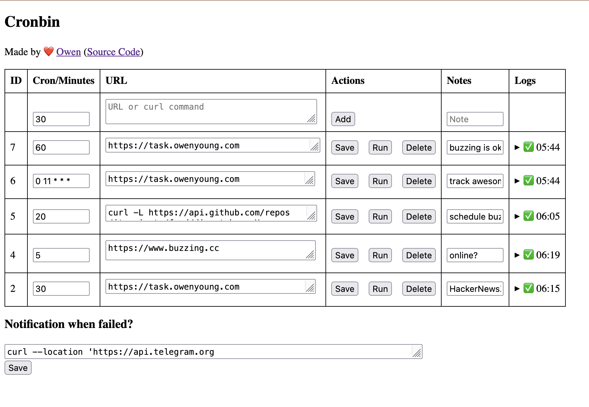

# Cronbin

## Dev

> Install Deno first

```bash
make cronserve
# or: deno run -A --watch ./scripts/cronbin/serve.js ./scripts/cronbin/serve.js
```

## Deploy

1. Create a KV namespane on [Cloudfalre](https://dash.cloudflare.com/) Workers panel with name `CRONBIN`
2. Create a worker on [Cloudfalre](https://dash.cloudflare.com/) workers panel, you can name it `cronbin`, then bind the KV created at step 1, go to settings -> Variables -> KV Namespace Bindings ,`name: `CRONBIN`.
3. Quick Edit worker code, with <https://github.com/theowenyoung/blog/blob/main/scripts/cronbin/main.js> , change the APIKEY, save it.
4. Go the the worker triggers settings, add cron trigger, `every 1 minutes`.
5. You can also add a custom domain on triggers settings.

Step 4 screenshot:



## Usage

First, visit <https://yourdomain.com/?key=abc>, then, the browser will remember your cookie, so next time, we can visit <https://yourdomain.com/> directly.

## Screenshot


