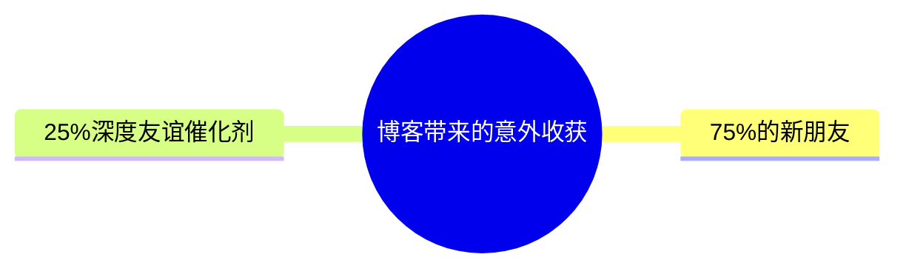

# 为什么你应该写博客

以及为什么我需要一个无社交功能的Tumblr

-- By Owen (owenyoung.com)

---

## layout: center

# 亚马逊：先写新闻稿理念

通过在产品开发前先写新闻稿，迫使团队用媒体和消费者能理解的语言，清晰定义产品的核心价值

<!-- 开始之前，我先提前厚颜无耻地为在demo day 分享这个还没开始开发的demo 找个好听点的理由

我之前在某篇文章里看过一个亚马逊的做事理念，先写新闻稿，通过在产品开发前先把新闻稿写了，以此迫使团队用媒体和消费者能理解的语言，清晰定义产品的核心价值
所以我想通过今天的分享，试图销售我想销售的理念，找到和我有同样微妙感觉的人。

-->

---

## layout: center

# 我遇到的所有最酷的人，都是通过我写的东西找到我的人

-- Derek Sivers

<!--
今天，我想和大家聊一个看似有些“老派”却非常有价值的话题：写博客。在社交媒体高度发达的时代，也许你会问：为什么还要费心写博客呢？我的答案是——博客能给我们带来社交媒体所无法提供的自由、深度思考，以及更有价值的人际联系。

Derek Sivers 在《Anything You Want》中说：
—— 这也是我过去几年的经历

https://www.owenyoung.com/about/

-->

---

## layout: center

# 任何一个普通人开始写博客的最强理由就是**你会拥有更多精彩的友谊**。

<!--

不仅是因为你会因为博客而结识到新的有趣的人

还因为写作会让你产生更多有趣的想法 - 这会让你现有的友谊更加精彩，因为你会有更好的话题可以聊。
-->

---

## layout: center

# 生活中大多数重要的事情，比如工作机会和亲密关系，都与朋友的质量息息相关

---

## layout: center

# 数据不会说谎

- 几乎每个人新认识我的人都会提到我的博客。
- 有一些优秀的同事也由于我的博客从而更加信任我们的团队，随后加入了我们。
- 每一次面基陌生人的时候，都是半熟人聊的更好

<!-- 我近3年认识的大约有 75%的新朋友 要么是通过我的博客第一次认识他们要么是通过互相评论对方的帖子显著加深了我们的友谊。还有 25%或更多的朋友是通过其中一个人间接认识的（这些人往往有其他我非常喜欢的朋友）。
你们已经在网上互相看过公开主页 基本了解这个人的大概了，然后再开始聊 就会聊的开心
但是如果是一个人突然给你打招呼，说我是做 UE 的
杭一末，如果 一个人进咖啡馆之后，如果他感兴趣今天和别人社交，那它可以扫码，留下自己的公开主页和座位号，咖啡馆的所有人都能看到。
-->

---

## layout: center

# 一个从不写作的人，对任何非琐碎的事情都不会有完全成型的想法

<!-- 最终写入文章的观点有一半是你在写作时想到的。比如我临时做的这个PPT。写作可以帮助你约束自己的思想。很多时候，只有当你把想法写在纸上时，看似严密的论证中的逻辑漏洞或无知之处才会显现出来。(反之亦然，如果你只在脑子里思考的话，这种思考往往会变得马虎。写下你学到的东西。它能促使你更好地理解主题。有时，只有在向他人解释时，我们的知识缺口才会变得清晰。-->

---

## layout: center

# 如果你写的是你自己真诚的想法、感受和感兴趣的东西......你就会引起其他人的兴趣

<!--甚至 没有什么原创的东西可以说，我只是会重复互联网上其他地方说过的内容！比如我的 quotes
- 我私下收集了一些我觉得很有趣的东西，并想其他人也可能会觉得有意思 比如我的 inspirations 页面
- 我想分享我的个人经历，并真诚认为其他人会觉得这很有用
- 我不同意一些人的观点，在网上留下了评论，并对我读到的东西有了一些想法
-->

---

## layout: center

# 现有的社交平台怎么了？

- 即时反馈循环
- 信息茧房效应
- 注意力经济与用户时间
- 算法优化内容及内容同质化现象
- 平台所有权: 你的内容随时可能因平台政策变化而消失
- 社交压力与心理影响
- 商业化对创作自由的影响
- 内容寿命短，404

<!--

1. 点赞、转发机制刺激多巴胺，让用户沉迷于即时反馈。这种反馈机制让用户习惯了短期快感，容易产生“点赞焦虑”和“转发焦虑”。有报道指出，一些用户会为了追求点赞而刻意迎合观众口味，甚至刻意制造争议，以获取更多关注。这种行为不仅影响了用户的创作热情，也容易让用户迷失自我，追求虚拟的社交认同。

现代社交平台普遍采用算法推荐内容，根据用户偏好进行个性化推送。这种机制一方面提高了用户粘性，另一方面也容易让用户陷入“信息茧房”。所以我关闭了小红书的设置里的 个性化推荐，我已经6个月没有刷过小红书了首页热门的东西很无聊k

2.设计为最大化停留时间和参与度，而非价值, 社交平台竞相争夺用户注意力，以延长使用时长为核心目标。算法会不断学习用户偏好，投喂让人停不下来的内容流。用户停留越久，能够刷到的广告越多、可变现的价值越高

3. 在流量导向的规则下，社交平台上的内容创作往往趋于雷同，缺乏多样性和深度。由于算法青睐易于传播、受众面广的内容，许多创作者选择迎合主流口味以获取更多曝光,倾向于情绪化、争议性内容，而非深度思考

4. 点赞、关注、转发等社交功能本意在增强互动，但无形中也给用户带来了心理压力。首先是形象管理的压力：在朋友圈、微博展示的多是美好生活和成就，久而久之形成“人设”。许多用户担心自己发的不够精彩，或是话题不讨喜，会无人问津甚至招致负评。这导致一些年轻人干脆不再发朋友圈，逃避这种“表演式社交” 。有报道指出，不少人觉得朋友圈已经从分享友情变成了一种人情压力场：发职场动态怕同事领导有看法，晒生活琐事又怕他人议论  。这种顾虑让人在社交平台上谨言慎行，甚至选择沉默。其次是社交比较和焦虑。当别人都在晒旅游、美食、晋升，自己的平凡生活容易被拿来比较，从而产生焦虑和自卑。有人戏称朋友圈里“别人永远在成功和幸福”，给自己造成了隐形压力 。再次，互动反馈的压力也不容忽视。例如有用户发了朋友圈或微博后会盯着点赞和评论数，“发出30分钟没人回应就默默删除” 。这表明平台上的反馈机制深刻影响着用户的情绪和行为。长此以往，为了迎合观众获取点赞，人们可能只展示光鲜的一面，隐藏真实想法，社交互动变得不再真诚。更严重的是，一些用户沉迷于获取关注和点赞的快感，陷入**“社交货币”成瘾**，当反响不如预期时又会产生失落抑郁。总的来说，社交平台在提供连接便利的同时，也放大了人际比较和舆论压力，对心理健康产生了复杂的影响。

-->

---

## layout: center

# 现有的博客平台怎么了？

- 阅读体验差: 广告、弹窗、追踪器影响阅读体验
- 技术门槛高: WordPress需要技术知识，Hugo 静态生成器也需要，都没有 tumblr 那样简单易用，支持短想法。
- 推送压力大
- 设计过度复杂: 面向专业作者而非普通人的日常表达
- 运营成本高
- 平台不稳定: 许多独立博客平台最终关闭或被收购
- 内容版权模糊

---

## layout: center

# 我想建造的乌托邦

- 博客平民化
- 一个让你想要写作的编辑器，像 Tumblr 一样简单易用
- 从第一天起就看起来很美但也不会花哨的公共主页，人类能专注于写作。
- 安静的，缓慢的，对人的注意力要求更低的，不追求点赞或关注者的创作工具
- 是一个‘用户’可以重新成为人的地方，以人类的速度进行社交。
- 世界上最简单、最易用、最持久的博客平台
- 真实的人类在分享他们的经历
- 像Tumblr 一样支持多种类型的帖子（短想法，文章，链接，图片，视频，音频，引用）
- 无点赞，无转发，无关注，无广告
- 默认情况下，帖子不会进入博客的 Feed 流，只有用户主动精选某篇文章的时候才会出现在 Feed 流中
- 完全开源，不锁定用户，但是也提供开箱即用的类似 Tubmlr 体验版本
- 自定义域名是一个免费功能，免费用户像 Pika 一样，限制文章数量
- 不通过广告或追踪用户来赚钱
- 有好用的桌面端，移动端原生 APP
- 可长期低成本的运行，用户如果为了省钱，甚至还可以自己绑定自己的 s3 存储

---

## layout: center

# 建造出来之前怎么办？

试试 Pika.page !

<!-- 我用 pika.page 实现了一个，打开 <owen.pika.page> good enough 团队，他们还有很多很有意思的小产品-->

---

# 为了拥有更加精彩的友谊，从今晚就开始写博客吧！

-> owenyoung.com

<!-- 揭晓一个秘密，就是连我的名字就是因为博客，我当时就想起个英文名，然后不知道叫什么好，所以就找来了美国最流行的前100个名字，然后和我姓，杨，排列组合之后，批量查询域名，看看哪个还没被注册就叫哪个，最好发现 OwenYoung.com 没有被注册。 -->
